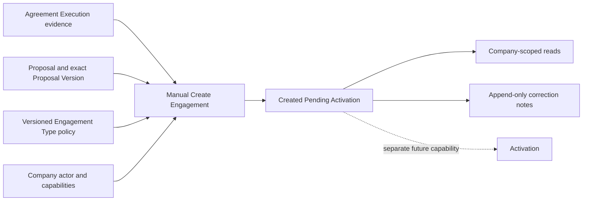

# Engagement Foundation Implementation Roadmap

Date: 2026-07-23

Status: Proposed — awaiting Product Architect and Product Owner review

Implementation Authorization: None

## Purpose

This roadmap converts the Product Owner-approved Engagement Foundation architecture in ADR-005 into an incremental delivery plan. It authorizes no application code, persistence, migration, API, UI, test, Activation, downstream operation, or production release.

The roadmap implements only:

- manual creation of one initial Engagement from one Agreement Execution;
- immutable `ENG-######` identity and exact Proposal-originated lineage;
- `CREATED_PENDING_ACTIVATION`;
- append-only correction notes;
- Company-scoped reads and server-authoritative permitted actions; and
- architecture, operational, and release evidence.

## Governing architecture

- ADR-000: capability methodology and gates
- ADR-005: canonical Engagement Foundation architecture
- ADR-012: permanent document retention
- ADR-015: Company workspace boundary
- ADR-017: Proposal, Agreement, and Engagement separation
- ADR-019: capability-based governance
- ADR-020: role administration
- Agreement Execution Sprint 7
- Engagement Foundation Sprint 0 Product Owner review package

No sprint may reinterpret Agreement evidence, infer legal enforceability, activate an Engagement, or introduce an excluded operational capability.

## Dependencies

### Required before implementation authorization

- Product Architect approval of ADR-005 conformance.
- Product Architect and Product Owner approval of this roadmap.
- Versioned Engagement Type policy reconciliation design approved in Sprint 0.
- Reviewed clean repository checkpoint through the normal development process.

### Required before production release, not before implementation

- Applicable Agreement, Electronic Signature, and Agreement Execution architecture approval.
- Applicable Product Owner operational acceptance.
- Operational readiness.
- Legal review where applicable.
- Engagement Foundation architecture conformance and Product Owner operational acceptance.

Engineering, testing, and non-production acceptance may proceed while production-release dependencies remain open.

## Capability dependency map

## Delivery principles

- Domain invariants precede schema, API, and UI.
- The caller supplies identifiers, not business facts.
- Every business fact resolves from its authoritative source.
- Source references remain immutable; Agreement evidence is never copied.
- Creation is manual, atomic, and durably idempotent.
- One Execution produces at most one Engagement.
- UI consumes server-projected permitted actions.
- Read models use direct CQRS projections.
- Factual language never becomes legal interpretation.
- Migrations are additive and forward-only.
- Each sprint has an independently reviewable commit boundary.

## Sprint 0 — Contract and policy reconciliation

### Objective

Freeze implementation-ready contracts and reconcile the approved universal initial state with existing versioned Engagement Type policy guidance without changing application behavior.

### Deliverables

- `CreateEngagementFromAgreementExecutionV1` boundary contract.
- Stable Engagement identity and `ENG-######` contract.
- Stable codes:
  - `CREATED_PENDING_ACTIVATION`;
  - `ENGAGEMENT_CREATED_PENDING_ACTIVATION`;
  - `ENGAGEMENT_CORRECTION_NOTE_RECORDED`;
  - approved correction-note Reason Codes.
- Exact authoritative source graph and field-source contract.
- Stable capability identifiers:
  - `engagement:view`;
  - `engagement:create-from-execution`;
  - `engagement:record-correction-note`.
- Forward versioning plan for Engagement Type policies:
  - preserve historical Version 1 contracts;
  - introduce a new policy version for future Engagement creation;
  - treat pre-Engagement workflow codes as upstream history;
  - make `CREATED_PENDING_ACTIVATION` the only aggregate initial state;
  - leave `ACTIVE` unreachable.
- Migration-readiness analysis for global numbering, uniqueness, source foreign keys, retention, and immutable audit evidence.
- Safe error taxonomy and factual business wording.
- No code or database change.

### Risks controlled

- Silent mutation of historical Engagement Type policy contracts.
- Role logic leaking into domain rules.
- Caller-provided business facts.
- Legal meaning leaking into status or errors.

### Acceptance criteria

- Every contract is versioned and traceable to ADR-005.
- No material Product Owner policy remains unresolved.
- Historical policy data has a forward-only reconciliation path.
- Agreement evidence remains Agreement-owned.
- Activation and Operations remain absent.
- Product Architect and Product Owner approve the Sprint 0 package before Sprint 1 authorization.

### Commit boundary

One documentation-and-contract review commit. No implementation files, schema, or migration.

## Sprint 1 — Pure Engagement domain

### Objective

Implement framework-independent Engagement creation and correction-note behavior.

### Deliverables

- Engagement aggregate/value objects.
- Immutable identity and lineage types.
- `CREATED_PENDING_ACTIVATION` as the only constructible state.
- Creation invariants independent of persistence.
- Correction-note Reason Code and factual-comment validation.
- Creation and correction-note events.
- Domain-level replay/conflict semantics where applicable.
- No Agreement, Proposal, authentication, Prisma, HTTP, or React imports.

### Explicit exclusions

- Number allocation.
- Source resolution.
- Persistence.
- Authorization adapters.
- Supersession.
- Reassignment.
- Activation or any transition.

### Acceptance criteria

- An Engagement cannot be constructed in any other status.
- Source identity and lineage cannot be mutated.
- Correction notes are append-only and cannot change the aggregate facts.
- Prior notes cannot be edited or deleted.
- Unsupported Reason Codes and structurally invalid comments are rejected deterministically; factual-use policy is also verified through UI guidance and operational acceptance.
- No lifecycle transition exists.
- Domain tests prove every invariant without infrastructure.

### Commit boundary

One domain-and-domain-test commit.

## Sprint 2 — Persistence, migration, and atomic evidence

### Objective

Provide durable Company-isolated storage, global numbering, immutable audit evidence, and transactional idempotency.

### Implementation order

1. Add global Engagement number sequence.
2. Add Engagement identity and immutable source-lineage persistence.
3. Add creation command receipt/idempotency persistence.
4. Add append-only Engagement event persistence.
5. Add append-only correction-note persistence.
6. Apply composite Company-scoped references.
7. Apply unique Agreement Execution and Engagement number constraints.
8. Apply immutability protections.
9. Add direct-read indexes.
10. Validate forward-only migration and recovery.

### Required constraints

- Global unique `engagementNumber`.
- Unique `agreementExecutionId`.
- Unique `(companyId, requestIdentity)` for each command boundary.
- Company-consistent source references.
- Restrictive deletion behavior for authoritative records.
- No cascade deletion of Engagement business evidence.
- Atomic number allocation, record, lineage, event, and command receipt.

### Migration validation

- Capture schema and migration status before change.
- Dry-run against representative data.
- Verify no upstream Proposal, Agreement, Signature, or Execution row changes.
- Verify sequence concurrency and permitted gaps.
- Verify duplicate Execution creation fails safely.
- Verify immutable evidence rejects mutation.
- Recovery uses forward correction or restore, never renumbering.

### Acceptance criteria

- Concurrent creation attempts yield one Engagement.
- Exact command replay returns the retained result.
- Conflicting request reuse fails without partial writes.
- Cross-Company relationships are rejected.
- Authoritative records cannot be deleted or rewritten through repositories.
- Database-backed tests prove rollback and isolation.

### Commit boundary

One schema/migration commit followed by one repository/database-test commit. Migration review precedes dependent application work.

## Sprint 3 — Application commands, source resolution, and authorization

### Objective

Orchestrate the approved manual creation and correction-note commands through ports while preserving bounded-context ownership.

### Deliverables

- Agreement Execution source resolver port.
- Proposal and Engagement Type lineage resolver port as required by the approved source graph.
- Active-actor provider.
- Effective-capability evaluator.
- Engagement repository and unit-of-work ports.
- `CreateEngagementFromAgreementExecution` application service.
- `RecordEngagementCorrectionNote` application service.
- Durable idempotency and correlation orchestration.
- Stable safe application errors.
- Production composition that does not expose infrastructure to presentation.

### Application sequence

1. Authenticate actor.
2. Enforce requested Company.
3. Evaluate effective capability.
4. Resolve the immutable source graph.
5. Confirm Proposal-owner eligibility.
6. Enforce all Company, Client, operating-group, and version consistency.
7. Execute the domain command transactionally.
8. Return the retained server result.

### Acceptance criteria

- Ineligible Proposal owner causes safe failure; no substitute owner is selected.
- Creation actor never becomes owner by default.
- Caller cannot override a resolved field.
- Missing, ambiguous, and mismatched source graphs fail closed.
- Founder/Admin inheritance follows ADR-019 through the capability evaluator, not domain role checks.
- Correction notes require the approved capability and Reason Code.
- No command reads or copies signer details or Agreement evidence.
- No command invokes Activation or downstream behavior.

### Commit boundary

One application-contract commit followed by one service/composition-test commit.

## Sprint 4 — Direct CQRS reads and HTTP API

### Objective

Expose authenticated Company-scoped operational reads and commands without expanding evidence access.

### Deliverables

- Direct Engagement list, detail, history, and Execution-eligibility read repositories.
- Server-projected permitted actions.
- Internal authenticated HTTP routes for:
  - list;
  - detail;
  - history;
  - creation eligibility;
  - manual creation;
  - correction note.
- Opaque pagination and concurrency/idempotency transport contracts.
- Safe error mapping and correlation propagation.
- Restrictive response contracts that exclude Agreement evidence.

### Read boundary

Engagement may expose:

- Engagement identity and pending status;
- approved operational Client, operating-group, owner, and Engagement Type information;
- Proposal and Proposal Version references;
- Agreement, Agreement Version, and Execution references;
- Execution timestamp;
- authorized source navigation;
- creation and correction-note history; and
- permitted actions.

It cannot expose or cache signer evidence, signature details, Execution actor, Agreement artifacts, Agreement text, or legal conclusions.

### Acceptance criteria

- Reads never reconstruct the Engagement aggregate.
- Every route rechecks Company and capability.
- `engagement:view` alone cannot retrieve underlying evidence.
- Agreement navigation delegates authorization to the Agreement subsystem.
- Creation is internal, manual, and idempotent.
- No public endpoint exists.
- Contract tests verify factual language and prohibited-field absence.

### Commit boundary

One read-model commit followed by one HTTP-adapter/contract-test commit.

## Sprint 5 — Minimal internal workspace

### Objective

Make the approved pending-record workflow operationally usable without introducing Activation or evidence duplication.

### Deliverables

- Company-scoped Engagement list.
- Engagement detail.
- **Create Engagement** action shown only from server-permitted eligibility.
- `Created — Activation Pending` status and approved factual explanation.
- Authorized navigation to source Proposal, Agreement, or Execution.
- Append correction-note interaction with controlled Reason Code and optional concise factual comment.
- Correction history.
- Accessible loading, confirmation, replay, conflict, and failure states.

### UI rules

- React consumes only typed HTTP contracts.
- UI never infers role, capability, creation eligibility, or status transitions.
- No Activate action or implied next operational step exists.
- No signer, signature, Agreement evidence, or Execution actor is duplicated.
- Prohibited legal phrases are absent.
- Successful commands refresh from server state.

### Acceptance criteria

- An authorized user can create one pending Engagement from an eligible Execution.
- An unauthorized or ineligible user cannot.
- Repeated submission cannot create duplicates.
- Users can find the Engagement by `ENG-######`.
- Users can record and view immutable correction notes.
- UI states clearly that delivery is not activated.
- Responsive and accessibility checks pass.

### Commit boundary

One typed-client/view-model commit followed by one workspace/UI-test commit.

## Sprint 6 — Architecture integrity and release readiness

### Objective

Verify the complete foundation against ADR-005 and prepare operational acceptance without expanding scope.

### Deliverables

- Architecture conformance review.
- Cross-boundary dependency audit.
- Security and Company-isolation review.
- Idempotency and concurrency verification.
- Data-retention and deletion-resistance verification.
- Factual-language and prohibited-claim audit.
- Operational acceptance scenarios.
- Release-readiness report separating implementation readiness from production readiness.
- Capability tracker and milestone documentation update.

### Operational scenarios

- Eligible manual creation.
- Duplicate and concurrent creation.
- Ineligible owner safe failure.
- Company, Client, group, Proposal Version, Agreement Version, and Execution mismatch failures.
- Correction note for every approved Reason Code.
- Clarification through a second note.
- Least-privilege Engagement viewing.
- Denied Agreement-evidence access despite Engagement visibility.
- No Activation or downstream side effects.

### Acceptance criteria

- All prior sprint criteria pass.
- No forbidden dependency or role check enters the domain or UI.
- No authoritative record can be deleted or rewritten.
- No derived data is mistaken for authoritative evidence.
- No legally consequential claim appears in business-facing output.
- Product Owner can exercise the complete workflow.
- Remaining production gates are listed explicitly and truthfully.

### Commit boundary

One conformance/remediation commit if required, followed by one documentation/release-evidence commit.

## Testing strategy

The future implementation must include:

- pure domain invariant tests;
- property or concurrency tests for number/idempotency uniqueness;
- application orchestration and source-authority tests;
- repository transaction, rollback, Company-isolation, and immutability tests;
- direct CQRS read tests;
- permission and permitted-action tests;
- HTTP contract and safe-error tests;
- UI behavior and accessibility tests;
- end-to-end manual-creation and correction-note scenarios;
- regression tests proving Proposal, Agreement, Signature, and Execution behavior is unchanged.

Testing verifies platform behavior. It does not certify legal enforceability.

## Risks and controls

| Risk                                                                      | Control                                                               |
| ------------------------------------------------------------------------- | --------------------------------------------------------------------- |
| Older Engagement Type workflows conflict with the universal initial state | Forward versioned reconciliation in Sprint 0; never rewrite history   |
| Engagement creation is mistaken for work authorization                    | Pending-only state, factual UI, no Activation command                 |
| Duplicate Engagements cause duplicate operations                          | Unique Execution, durable idempotency, transactional creation         |
| Wrong Client or Company is linked                                         | Complete server-resolved source graph and composite constraints       |
| Inactive owner is silently replaced                                       | Fail closed; no substitution or creator fallback                      |
| Engagement view leaks sensitive Agreement evidence                        | Minimal provenance and separate Agreement authorization               |
| Correction notes become legal-opinion fields                              | Controlled codes, concise factual comment, immutable audit            |
| Permanent retention expands unnecessary data                              | Retain minimal authoritative evidence; govern derived data separately |
| Implementation is mistaken for production readiness                       | Separate release gates and truthful milestone reporting               |

## Intentionally deferred technical and capability scope

- Activation and every transition out of `CREATED_PENDING_ACTIVATION`;
- automatic creation;
- owner reassignment;
- supersession;
- direct/no-Proposal Engagements;
- tasks, schedules, milestones, deliverables, work plans, and team assignment;
- delivery workflow;
- billing, invoices, payments, collections, and refunds;
- renewals, extensions, cancellation, and termination;
- public or client portal behavior;
- notifications and reminders;
- legal interpretation;
- exceptional-access workflow and legal-hold tooling;
- full Engagement Management.

Deferred items must not receive partial implementation.

## Proposed pull-request sequence

1. Sprint 0 contracts and policy reconciliation.
2. Sprint 1 pure domain.
3. Sprint 2 migration and persistence.
4. Sprint 3 application/source resolution.
5. Sprint 4 CQRS and HTTP.
6. Sprint 5 internal workspace.
7. Sprint 6 conformance and release evidence.

Each pull request must be independently reviewable, preserve passing regression tests, and avoid unrelated changes.

## Final capability exit criteria

Engagement Foundation is complete only when:

- ADR-005 and this roadmap are approved;
- every sprint passes its acceptance criteria;
- one eligible Execution produces one pending Engagement through a manual authorized action;
- exact source authority and immutable lineage are preserved;
- correction notes are controlled and append-only;
- Company isolation and evidence permissions pass;
- no Activation or downstream effect exists;
- architecture conformance passes;
- Product Owner operational acceptance is recorded;
- production release gates are truthfully evaluated; and
- the capability tracker and release evidence are current.

Implementation completion does not equal production readiness.

## Roadmap review gate

Reviewers must confirm:

1. the roadmap implements all approved EF decisions without inventing policy;
2. historical Engagement Type contracts are reconciled forward;
3. Engagement remains separate from Agreement evidence and Operations;
4. production legal/operational gates do not block non-production engineering;
5. every sprint is independently verifiable; and
6. approval of this roadmap, if granted, explicitly identifies the first authorized implementation sprint.
