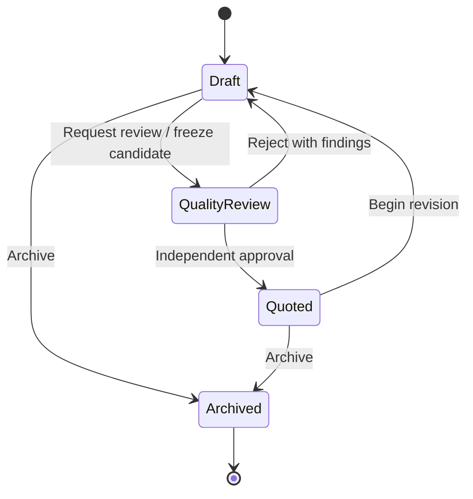

# Pricing Approval Sprint 2.6 Review Package

Date: 2026-07-21

Status: Complete — awaiting Product Architect and Product Owner review

Implementation: Paused — documentation only

## ADR summary

ADR-021 governs how Pricing output becomes eligible for Proposal creation. It retains the existing `DRAFT`, `IN_REVIEW`, `QUOTED`, and `ARCHIVED` codes, identifies `IN_REVIEW` as Pricing Quality Review, and creates immutable Pricing Versions at review boundaries.

Pricing remains the calculation and approval authority. Proposal consumes exactly one current approved immutable Pricing Version and never approves, modifies, or recalculates Pricing.

## Architecture decisions

1. `DRAFT` is the only mutable state.
2. A review request atomically freezes and binds one immutable candidate version and moves the project to `IN_REVIEW`.
3. Only an active same-Company Founder/Admin with Pricing review capability may decide a review.
4. The reviewer can never be the candidate creator.
5. Approval selects that exact candidate as current and approved, and moves the project to `QUOTED` atomically.
6. Rejection retains the candidate and findings, and returns the project to `DRAFT`.
7. Executive Authorization cannot bypass Pricing Quality Review in Version 1.
8. `QUOTED` means commercially approved, backed by one current immutable approved version, and eligible for new Proposal creation.
9. Beginning a revision returns `QUOTED` to `DRAFT` without changing earlier versions.
10. Earlier approved versions remain historical but become stale for new Proposal creation.
11. `ARCHIVED` is retained, ineligible for new Proposals, and terminal in Version 1.
12. Proposal freezes one current approved version and never changes automatically with later Pricing activity.

## Lifecycle diagram

## Capability decisions

| Action | Member | Admin | Founder |
| --- | --- | --- | --- |
| Create/edit authorized Draft | Allowed | Allowed | Allowed |
| Request Quality Review | Allowed | Allowed | Allowed |
| Decide another creator's review | Not allowed | Allowed | Allowed |
| Decide own review | Not allowed | Not allowed | Not allowed |
| Begin authorized revision | Allowed | Allowed | Allowed |
| Archive own/authorized Draft | Allowed | Allowed | Allowed |
| Archive authorized `QUOTED` project | Not allowed | Allowed | Allowed |

Role defaults follow ADR-019 and ADR-020. Effective capabilities and Company scope—not UI visibility—control authorization.

## Audit and immutability

Quality Review permanently records the Pricing Project and estimate number, candidate version, Company, Client, creator, reviewer, request and decision timestamps, outcome, Review Method, rejection findings, resulting status, and approved version when applicable.

Business Justification remains governed by ADR-019. Because ADR-021 authorizes no alternate Pricing approval path, Business Justification cannot replace independent review.

Candidate content, review decision, lifecycle transition, and current-version binding are append-only or atomic as applicable. Rejected, superseded, and approved versions remain permanent.

## Proposal consumption boundary

At creation, a Proposal may consume exactly one current approved version from a currently `QUOTED` project. It retains source project, version, approval, configuration, methodology, and commercial snapshot identities needed for reproduction.

Proposal cannot invoke Pricing calculations, review or approval commands, archival, or other Pricing lifecycle transitions. Later Pricing revision or archival never changes an existing Proposal.

## Cross-reference updates

- ADR-016 delegates Pricing approval, immutable versions, and `QUOTED` eligibility to ADR-021.
- ADR-017 references ADR-021 as the Pricing eligibility authority without changing Proposal lifecycle rules.
- ADR-018 requires Sprint 3 to read the current approved version through the Pricing read boundary and includes ADR-020/021 as related decisions.
- The ADR registry lists ADR-021 in the Pricing category.
- ADR-020 and its review package now record the approval stated in this directive; ADR-020 decision content is unchanged.

## CB-2 resolution matrix

| Required decision | Resolution |
| --- | --- |
| Pricing approval | Independent Founder/Admin Quality Review of one frozen candidate. |
| `QUOTED` eligibility | One current approved immutable version plus permanent approval evidence. |
| Reviewer independence | Candidate creator can never decide that candidate, regardless of role. |
| Approved Pricing Version | Content freezes at review request; approval selects it without rewriting it. |
| Rejection | Candidate and findings remain; project returns to Draft. |
| Stale versions | History remains permanent; only the current version of a `QUOTED` project is eligible. |
| Proposal consumption | Exactly one eligible version is frozen; Proposal never mutates or recalculates it. |
| Audit | Creator, reviewer, Company, timestamps, outcome, and version are permanent and atomic with state. |
| Authority | Request, decision, revision, and archive defaults align with ADR-019/020. |

CB-2 is fully resolved at the architecture-policy level. Implementation no longer needs to invent Pricing approval, `QUOTED` eligibility, reviewer independence, approved-version semantics, stale-version handling, or Proposal consumption rules.

## Compliance checklist

| Review item | Result |
| --- | --- |
| ADR-000 methodology followed | Passed |
| ADR-016 calculation ownership preserved | Passed |
| Proposal boundary and frozen contracts preserved | Passed |
| ADR-019 governance and independence preserved | Passed |
| ADR-020 Company authority preserved | Passed |
| Existing lifecycle machine codes retained | Passed |
| Company isolation explicit | Passed |
| Immutable history explicit | Passed |
| No code, UI, API, database, schema, migration, or service change | Passed |
| Sprint 3 remains paused | Passed |

## Review notes

1. ADR-021 is `Proposed` pending Product Architect and Product Owner approval.
2. Existing status persistence is not implementation of this newly governed workflow.
3. Future implementation requires separately authorized Pricing application, persistence, authorization, and audit work. This package does not assign that work to Sprint 3 or any other sprint.
4. Strict independence deliberately means a single active user cannot make their own Pricing Version `QUOTED`.
5. ADR-021 resolves only CB-2 and changes no other readiness finding.
6. Sprint 3 has not begun and remains paused pending review and all remaining gates.

## Product Architect and Product Owner review gate

Reviewers should confirm the lifecycle, strict independence, prohibition on Pricing Executive Authorization, revision and stale-version behavior, archive authority, and Proposal boundary before approving implementation reliance on ADR-021.
