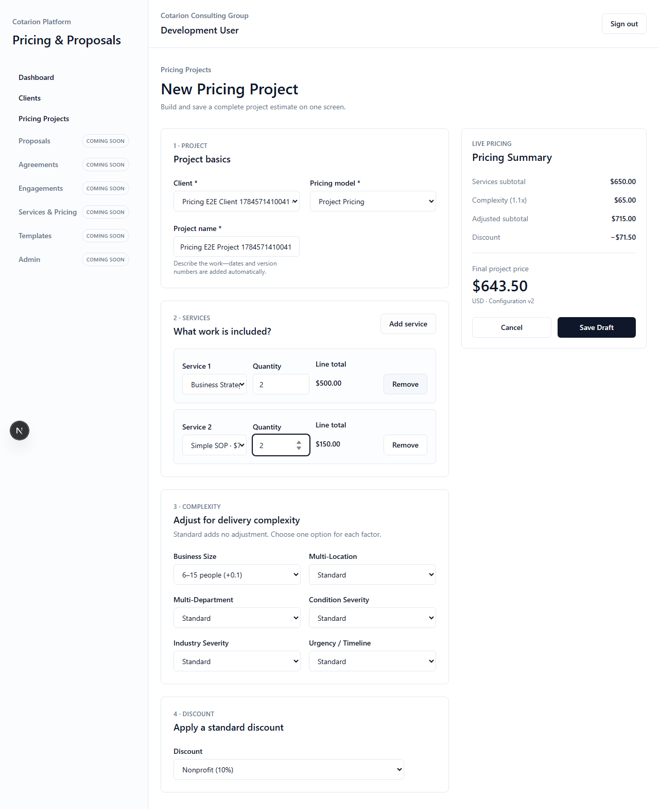
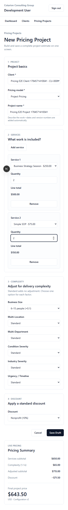
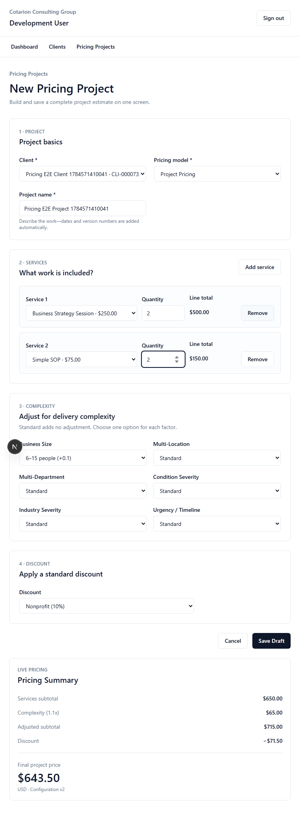
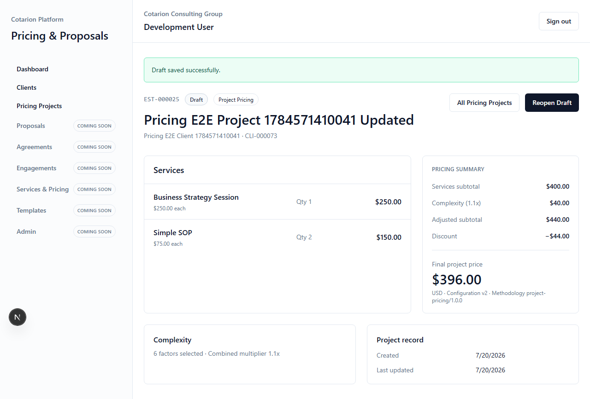

# Sprint 4 — Phase 4 Interactive Pricing Workspace

## Product Owner Review Package

Date: 2026-07-20

## Outcome

Phase 4 provides the first complete, usable Pricing Project workflow. An authenticated user can select an existing Client, name the work, add any number of approved services, select all six complexity factors, apply one approved discount, see the authoritative price update immediately, save the project as a Draft, view its immutable estimate number, and reopen the Draft for editing.

The approved Pricing Domain, calculations, database schema, repository interfaces, estimate allocation, business rules, and persistence architecture were not changed.

## Screen Map

| Screen | Route | Purpose |
| --- | --- | --- |
| Dashboard | `/` | Clients-focused starting point with a New Pricing Project action |
| Clients | `/clients` | Existing Client list with a New Pricing Project action |
| Client detail | `/clients/[clientId]` | Starts a Pricing Project with the Client preselected |
| Pricing Projects | `/pricing-projects` | Lists Pricing Projects with status, Client, amount, and reopen action |
| New Pricing Project | `/pricing-projects/new` | One-screen project creation workspace |
| Pricing Project detail | `/pricing-projects/[pricingProjectId]` | Read-only project record and pricing summary |
| Edit Draft | `/pricing-projects/[pricingProjectId]/edit` | Reopens a Draft in the one-screen workspace |

## Navigation Flow

1. Sign in through the existing authentication flow.
2. Open **Pricing Projects** from desktop or mobile navigation.
3. Select **New Pricing Project**, or start from a Client to preselect it.
4. Complete project basics, services, complexity, and discount on one screen.
5. Review the live Pricing Summary and select **Save Draft**.
6. View the saved project, its `EST-######` reference, status, services, and totals.
7. Select **Reopen Draft** to edit and save the Draft again.
8. Return to **All Pricing Projects** to locate the saved record.

Future modules remain visible and disabled with **Coming Soon** indicators.

## UI Screenshots

### Desktop Pricing Workspace

### Mobile Pricing Workspace

### Tablet Pricing Workspace

### Pricing Project Detail

## Feature Summary

- Existing protected application shell and authentication are preserved.
- Pricing Projects is enabled in desktop and mobile navigation.
- Client selection is Company-scoped and can be preselected from Client detail.
- The required project name describes the work; dates and versions are added by the system.
- Service selection uses the approved Company Service Catalog with no free-text services.
- Users can add and remove dynamic service lines and enter decimal quantities.
- All six complexity factors provide their approved options, including Standard.
- The approved standard discounts are available as a single selection.
- The live summary shows service subtotal, complexity adjustment, adjusted subtotal, discount, and final USD price.
- Live and persisted results are calculated by the approved Phase 2 Pricing Domain.
- Save Draft creates the persisted Pricing Project and immutable estimate number.
- Drafts can be viewed and reopened for editing; the Client remains immutable after creation.
- Status is displayed on list and detail views.
- Layouts stack for mobile use and preserve fast access to primary navigation and save actions.

## Known Limitations

- Phase 4 supports Draft creation and editing. It displays other persisted statuses but does not add status-transition workflow controls.
- Project list aggregation uses the approved existing Client repository contract. It is therefore limited to the first 100 Company Clients until a future approved repository capability supports direct Company project listing.
- Client selection is subject to the same existing 100-client list boundary.
- Pricing Project search, sorting, and filtering are not included.
- Draft saving is explicit; there is no autosave or unsaved-changes warning.
- The mobile Pricing Summary follows the form so primary entry fields remain first in reading order.
- Configuration, Service Catalog, version management, approvals, internal review, proposals, PDFs, reporting, analytics, and notifications remain outside this phase.

## Suggested UX Improvements

These are interface refinements only and do not require backend redesign:

- Add project search and status filters when the project volume justifies them.
- Add an unsaved-changes warning and optional local draft recovery.
- Consider a collapsible or sticky mobile Pricing Summary after usability feedback.
- Add service grouping or quick-add shortcuts based on observed service-selection patterns.
- Add a compact project-status action area when lifecycle transitions are authorized for a later phase.
- Review whether the Pricing Projects list or Dashboard should be the default landing screen after Product Owner usage.

## Validation Results

| Gate | Result |
| --- | --- |
| `npx prisma validate` | Passed |
| `npx prisma generate` | Passed — Prisma Client 7.8.0 |
| `npm run lint` | Passed |
| `npm run typecheck` | Passed |
| `npm run test` | Passed — 67 tests across 12 files |
| `npm run test:e2e` | Passed — 4 Chromium workflows |
| `ENABLE_DEV_AUTH=false npm run build` | Passed — production build and all Pricing Project routes |

The end-to-end Pricing Project workflow validated Client creation, Client preselection, two service lines, live complexity and discount calculations, a `$643.50` initial total, Draft persistence, immutable estimate display, Draft reopening, a `$396.00` updated total, list display, desktop, tablet, and mobile responsive navigation, and test-data cleanup.

## Product Owner Launch

- Development URL: `http://localhost:3000`
- Primary login: select **Sign in with Microsoft** and use an authorized Microsoft Entra account.
- Local fallback: when development authentication is enabled in the local development environment, select **Development sign-in**.
- The local fallback is not available in production and was verified to fail closed during the production build.

## Non-blocking Warnings

- Next.js warns that future versions will require an explicit `allowedDevOrigins` setting for the Playwright development-server origin.
- The PostgreSQL driver warns about future SSL-mode semantic changes and recommends explicitly selecting the intended mode before its next major version.
- The PostgreSQL driver also reports a deprecation warning for concurrent `client.query()` behavior exercised by existing database flows.
- Vite reports that its CommonJS Node API is deprecated.

These warnings did not fail validation and are not Phase 4 architecture changes.
