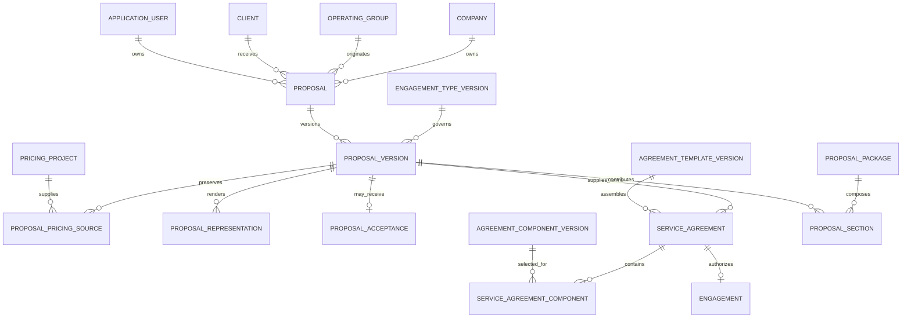
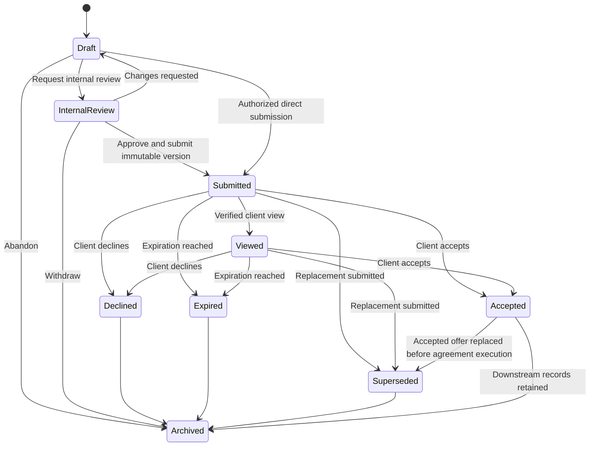
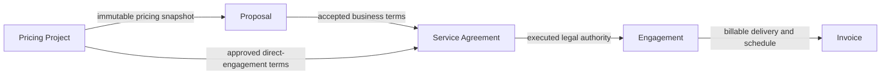
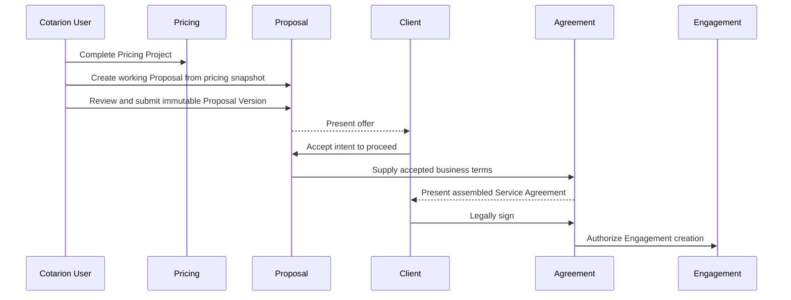
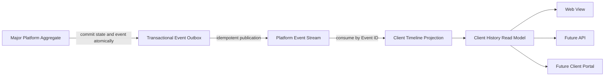
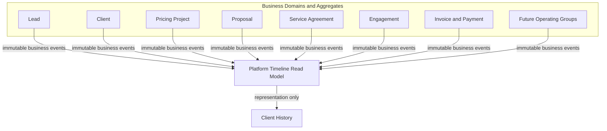

# ADR-017: Proposal Management Business Architecture

## Date

2026-07-20

## Status

Product Owner Approved — amended 2026-07-20

## Decision Summary

Proposal Management will be a distinct business domain. A `Proposal` is a versioned business offer from one Cotarion operating group to one Client. In Version 1 it is created from exactly one immutable Pricing Project snapshot, but it is neither a rendered document nor a legal agreement.

The Proposal record is the system of record. Web pages, PDFs, portal experiences, emails, and API responses are representations generated from an immutable `ProposalVersion`.

Version 1 will implement single-operating-group proposals for Cotarion Consulting Group. The domain will expose explicit boundaries that allow a future corporate `ProposalPackage` to compose independently owned operating-group Proposal Sections without moving Consulting pricing or proposal rules into a corporate domain.

Proposal acceptance and Service Agreement signature are separate business events:

- Proposal acceptance records the Client's intent to proceed with the offered business terms.
- Service Agreement signature records legal consent.
- Every Engagement must ultimately reference an executed Service Agreement.

## Business Context

Cotarion needs to turn approved pricing into an offer, preserve exactly what the Client received, record the Client's commercial decision, assemble the appropriate legal agreement, and create an Engagement without recreating prior records.

The design must preserve the platform principles that Clients are the center of operational records, future modules reference prior records rather than recreate them, major business records receive immutable reference numbers, and Client history becomes a chronological relationship timeline.

## 1. Proposal Domain

### Definition

A Proposal is a major business record representing a commercial offer to one Client from one owning Company and one operating group.

A Proposal:

- Has an immutable human-readable reference number in `PRO-######` format.
- Belongs to exactly one Company and Client.
- Is owned by one Application User.
- Has one Engagement Type.
- References exactly one eligible Pricing Project from the same Company, Client, currency, and operating group.
- Owns a sequence of immutable Proposal Versions.
- Has one mutable lifecycle projection describing the current business state.
- Records acceptance, decline, expiration, supersession, and archival events.
- May later be represented through web, PDF, portal, email, or API channels.

A Proposal is not:

- A PDF or file.
- A Pricing Project.
- A contract or Service Agreement.
- An Engagement.
- A mutable copy of Client, pricing, or legal records.

### Business terminology

Use business-facing names such as Proposal, Proposal Version, Proposal Section, Service Agreement, Engagement Type, Commercial Terms, and Acceptance. Avoid exposing technical terms such as payload, blob, renderer, or state machine in the user interface.

## 2. Domain Model

### Core records

#### Proposal

Aggregate root and stable business identity:

- `id`
- immutable `proposalNumber`
- `companyId`
- `operatingGroupId`
- `clientId`
- `ownerId`
- `engagementTypeId`
- `proposalPackageId` nullable and future-facing
- `currentVersionId` nullable until the first version is saved
- `status`
- `expiresAt` nullable
- `supersedesProposalId` nullable
- created and last-updated timestamps

The operating-group identity should be an explicit reference, not inferred from wording or the selected template. Version 1 supplies only Cotarion Consulting Group.

#### ProposalVersion

Immutable child record:

- `id`
- `proposalId`
- monotonically increasing version number within the Proposal
- immutable creation timestamp and creator
- title and generated narrative content
- Engagement Type snapshot
- Pricing Project source references
- immutable pricing snapshots
- pricing methodology and configuration references
- commercial terms snapshot
- Client presentation snapshot
- selected services and deliverables snapshot
- content/template/component version references
- representation-ready structured content
- content schema version
- status at creation, such as Draft Version or Submitted Version

Saving ordinary Draft edits may update a mutable working draft. Explicit version creation freezes a Proposal Version. Submission must always reference an immutable version and may create one automatically if the current working draft has not been frozen.

Once referenced by a submission, acceptance, decline, Service Agreement, or Proposal Package, a Proposal Version can never be changed or deleted.

#### ProposalPricingSource

Immutable association owned by Proposal Version:

- `proposalVersionId`
- `pricingProjectId`
- estimate number
- Pricing Project model and currency
- pricing methodology version
- Pricing Configuration version ID and number
- immutable Pricing Project input/output snapshot
- selected offered amount or percentage
- presentation order

Version 1 uses exactly one Pricing Project for one Proposal. The Pricing Project may contain multiple services and recommendations. Future multi-department combinations belong to Proposal Packages composed from independent Proposal Sections. Proposal Management never recalculates pricing.

#### ProposalCommercialTerms

Immutable value object inside Proposal Version:

- offer expiration date
- payment schedule
- billing method
- deposit or initial-payment terms
- recurrence and term
- cancellation summary
- assumptions and exclusions
- client responsibilities
- optional offer-specific notes

Legal clauses belong to the Agreement domain, not ProposalCommercialTerms.

#### ProposalAcceptance

Append-only business event:

- Proposal and accepted Proposal Version
- accepting person/contact
- channel
- acceptance timestamp
- authenticated identity or verification evidence
- optional comment
- recorded terms acknowledgement

Only the currently submitted, non-expired, non-superseded version can be accepted.

#### ProposalRepresentation

Metadata for a generated representation, not the Proposal itself:

- Proposal Version
- representation type: Web, PDF, Portal, Email, or API
- renderer/version
- storage reference where applicable
- content checksum
- generated timestamp

Representations are reproducible outputs. A retained Client-facing representation may be immutable for evidentiary purposes.

#### EngagementType

Versioned configuration owned by an operating group:

- stable immutable code
- business name and description
- Proposal Required flag
- Agreement Template reference
- Billing Method
- workflow definition reference
- default Proposal, Agreement, and Engagement statuses
- allowed Pricing Models
- active status and effective version

#### ServiceAgreement

Separate aggregate and legal system of record:

- immutable recommended reference `AGR-######`
- Company, operating group, Client, and owner
- source Proposal and accepted Proposal Version when applicable
- Engagement Type
- Agreement Template version
- assembled Agreement Component versions
- approved business-terms snapshot
- lifecycle and signature status
- executed representation and signature evidence

#### Engagement

Separate operational aggregate:

- immutable recommended reference `ENG-######`
- Client, Company, operating group, and owner
- executed Service Agreement ID
- source Proposal ID where applicable
- Engagement Type and delivery workflow

An Engagement cannot enter an active delivery state without an executed Service Agreement.

## 3. Aggregate Boundaries

### Proposal aggregate

Owns:

- Proposal identity and lifecycle
- mutable working draft
- immutable Proposal Versions
- Pricing source snapshots
- commercial terms snapshots
- submission and commercial-decision events

Enforces:

- Company, Client, currency, and operating-group consistency
- immutable version numbering
- legal lifecycle transitions
- acceptance only against an eligible submitted version
- historical immutability

Does not own:

- Pricing calculation
- Agreement clauses or signatures
- Engagement delivery
- stored document bytes
- Client master data

### Pricing Project aggregate

Remains authoritative for pricing methodology and calculation. Proposal Management reads an eligible immutable pricing snapshot and never recalculates or mutates Pricing Projects.

### Agreement aggregate

Owns legal assembly, legal text versions, execution, signatures, and legal representations. It consumes approved commercial terms from a Proposal Version or an approved direct-engagement input.

### Engagement aggregate

Owns delivery state and operations. It references an executed Service Agreement rather than duplicating agreement or Proposal content.

### Proposal Package aggregate — future

A corporate aggregate that composes immutable operating-group Proposal Sections. It coordinates presentation and package-level lifecycle without owning or rewriting section pricing methodology.

### Configuration aggregates

Engagement Types, Proposal Templates, Agreement Templates, and Agreement Components are separately versioned configuration aggregates. Business records reference immutable effective versions.

## 4. Entity Relationships

All cross-record references must enforce Company ownership. Client-facing records must reference the same Client. Operating-group Proposal Sections retain their own operating-group ownership when composed into a future package.

## 5. Proposal Lifecycle

### Recommended statuses

- `DRAFT`: Editable working offer; never exposed as a Client submission.
- `INTERNAL_REVIEW`: Content and commercial terms are frozen for internal review; revisions return it to Draft.
- `SUBMITTED`: One immutable Proposal Version has been formally sent or made available.
- `VIEWED`: The submitted version has verified Client viewing evidence.
- `ACCEPTED`: The Client accepted the submitted commercial offer.
- `DECLINED`: The Client declined the submitted offer.
- `EXPIRED`: The offer passed its expiry without acceptance.
- `SUPERSEDED`: A replacement Proposal or later submitted version invalidated this offer.
- `ARCHIVED`: Administratively retained and removed from active work queues.

`VIEWED` is useful operational state but viewing events must also be retained separately. The current status is a projection; append-only events preserve when and how the transition happened.

### Transition rules

Recommendations:

- Submission identifies exactly one immutable submitted Proposal Version.
- Editing a submitted offer creates a new working revision; it never changes the submitted version.
- Submitting a replacement version supersedes the prior submitted version and invalidates its acceptance endpoint.
- Acceptance is prohibited after expiry or supersession.
- Declined and Expired proposals may be revised into a new version and resubmitted through an explicit reopen/revise action; historical states remain as events.
- Archive is organizational, not deletion, and never removes historical records.

## 6. Immutable Proposal Versioning

### Working draft and immutable versions

Use two concepts:

1. A mutable Proposal working draft for efficient editing and autosave.
2. Immutable Proposal Versions created by explicit `Save Version`, internal-review, or submission actions.

Each version receives a Proposal-local sequential number. Concurrency-safe allocation is required.

### Snapshot policy

Every Proposal Version freezes:

- Source Pricing Project IDs and estimate numbers.
- Pricing model, methodology version, engine version, and configuration version.
- Pricing inputs, adjustments, calculations, discounts, rounding, and selected offer result.
- Service names, descriptions, quantities, and Client-facing labels presented.
- Generated narrative and structured content.
- Commercial terms and expiration.
- Engagement Type configuration version.
- Proposal Template and content-component versions.
- Client presentation data and recipient information used at that time.

Snapshots preserve history; source references preserve traceability. Both are required.

Future changes to Pricing Projects, Clients, templates, Engagement Types, or configurations must not mutate a Proposal Version.

### Revision policy

- A new version starts from a deliberate copy of the prior version or current working draft.
- The version records its predecessor and revision reason.
- Differences can later be presented as a comparison.
- A new version does not automatically supersede a submitted version until the new version is submitted.
- Proposal version numbers are not embedded in the user-defined Proposal title.

## 7. Proposal Packages

### Version 1 decision

Implement only direct single-operating-group Proposals for Cotarion Consulting Group.

### Future architecture

A future `ProposalPackage` is a corporate orchestration aggregate with its own package number, Client, lifecycle, current package version, and representations. A package version composes ordered `ProposalSection` references.

Each Proposal Section:

- References an immutable Proposal Version owned by one operating group.
- Retains its own pricing, methodology, configuration, commercial terms, and ownership.
- Supplies a representation-neutral section document.
- Cannot be modified by the package.

The package may add corporate introduction, combined presentation, shared acceptance experience, and package-level commercial coordination. It must not merge calculation engines or rewrite operating-group records.

This composition boundary supports future Marketing, Technology, HR, Bookkeeping, and other groups without adding those capabilities to Version 1.

## 8. Service Agreements and Downstream Records

Rules:

- Proposal is optional only when the configured Engagement Type says it is not required.
- Service Agreement is mandatory for every Engagement.
- A no-Proposal workflow still requires approved business terms from Pricing Project or another explicitly authorized source.
- Service Agreement generation references the accepted Proposal Version when a Proposal exists.
- Engagement references the executed Service Agreement.
- Invoice references the Engagement and applicable commercial schedule; it does not infer terms from mutable Client or Pricing records.

### Recommended workflow

## 9. Agreement Engine

### Separation of concerns

#### Agreement Template

A versioned structure defining:

- Agreement title and document family.
- Required section slots and ordering.
- Applicability to Engagement Types.
- Required and optional Component categories.
- Assembly rules and representation layout metadata.

Template-family examples, including future operating groups:

- Strategy Session
- Consulting Engagement
- Retainer
- Training (future HR operating group)

#### Agreement Component

A reusable, independently versioned legal/business clause with:

- stable component code
- title and category
- approved text
- variables/input contract
- applicability predicates
- required/optional status
- ordering guidance
- effective and retirement dates

Initial examples:

- Confidentiality
- Payment Terms
- Service Descriptions
- Deliverables
- Cancellation
- Intellectual Property
- Profit Share
- Recurring Billing
- Hourly Terms

### Assembly

The Agreement domain selects immutable Template and Component versions using:

- Engagement Type
- selected Services
- Pricing Model
- approved Commercial Terms
- Client information
- Company and operating-group identity

Assembly produces a structured, immutable Service Agreement Version before rendering. Rule evaluation must be deterministic, explainable, and versioned. Manual clause assembly should be exceptional and explicitly audited.

Version 1 Proposal Management may define the downstream contract and integration port, but Agreement Engine implementation belongs to the Agreements capability.

## 10. Engagement Types

Engagement Types are versioned configuration, not hardcoded branches.

Initial Consulting Group types:

- Strategy Session
- Advisory
- Diagnostic
- Project
- Retainer

Training is intentionally excluded from Consulting Group and belongs to the future HR operating group.

Each effective Engagement Type Version defines:

- whether a Proposal is required
- Agreement Template version or selection policy
- Billing Method
- allowed Pricing Models
- Proposal workflow key
- Agreement workflow key
- Engagement workflow key
- default statuses
- required commercial inputs
- required Agreement Components

Workflow configuration should use a constrained catalog of application-supported transitions and policies. Avoid arbitrary executable scripts in configuration.

Business records preserve the effective Engagement Type Version used. Updating configuration affects new records only.

## 11. Proposal Acceptance and Agreement Signature

### Proposal acceptance

Meaning: “I want to move forward with this commercial offer.”

Recommended flow:

1. Client reviews a submitted immutable Proposal Version.
2. Client accepts through an authenticated portal action, secure one-time link, or authorized internal recording process.
3. The platform records acceptance evidence against that exact version.
4. Proposal becomes Accepted.
5. Agreement generation begins from the accepted business terms.

Acceptance does not create an active Engagement and must not be represented as a legal signature.

### Service Agreement signature

Meaning: “I agree to these legal terms.”

Recommended flow:

1. Agreement Engine assembles a Service Agreement from accepted or otherwise approved business terms.
2. Cotarion reviews and issues an immutable Agreement Version.
3. Authorized parties sign through an electronic-signature provider or approved process.
4. Signature evidence and the executed representation are retained.
5. Agreement becomes Executed.
6. Only then may the Engagement enter an active delivery state.

The UI must use distinct actions, confirmations, audit events, and language for Accept Proposal and Sign Agreement.

## 12. Application Architecture

### Layers

- Presentation: Proposal workspace, review, submission, viewing, acceptance, and history.
- Application: create/revise/version/submit/view/accept/decline/expire/supersede use cases.
- Proposal Domain: lifecycle, versioning, eligibility, acceptance, and snapshot invariants.
- Infrastructure: repositories, representation renderers, storage, email, portal, analytics events, and signature-provider adapters.

### Integration boundaries

Define ports for:

- reading eligible Pricing Project snapshots
- reading Client and Contact presentation data
- reading versioned Engagement Type and template configuration
- rendering Proposal representations
- delivering submissions
- recording verified views
- requesting Agreement creation
- publishing timeline and analytics events

Proposal Management must not import pricing calculator implementations. It consumes an immutable Pricing result contract.

### Extension points

- Operating-group ownership on business and configuration records.
- Representation renderer interface.
- Delivery-channel interface.
- append-only Proposal events.
- versioned structured-content schema.
- package composition contract.
- Agreement creation command.
- analytics event stream.
- AI drafting port that proposes content but cannot publish, accept, or mutate immutable versions.

## 13. Platform Timeline (Client Timeline)

### Architectural role

The Platform Timeline is the unified chronological Client History read model for the Cotarion Platform. It is not a business domain, aggregate, workflow engine, audit authority, or source of business truth.

The Timeline:

- Owns no business state or business rules.
- Cannot create, update, transition, archive, or delete source business records.
- Consumes only published immutable business events.
- Produces representation-only Client History views.
- Remains decoupled from Proposal, Agreement, Engagement, Billing, and operating-group implementations.

Each source aggregate owns the decision to publish a business event and the meaning of that event. The Timeline projects those events without importing the source domain, querying its internal tables to reconstruct history, or invoking its application services.

### Event sources

The event contract and projection must support, at minimum:

- Lead
- Client
- Pricing Project
- Proposal
- Proposal Version
- Proposal Acceptance
- Service Agreement
- Engagement
- Invoice
- Payment

The same contract must support future events from Tasks, Notes, Meetings, Documents, Operating Groups, Marketing, HR, Technology, Bookkeeping, AI activity, and the Client Portal. Adding a source requires publishing conforming events, not changing Timeline business logic.

### Immutable event envelope

Every event must include:

- `eventId`: globally unique immutable event identifier.
- `occurredAt`: authoritative UTC business-event timestamp.
- `companyId`: owning Company.
- `clientId`: Client whose relationship history receives the event.
- `eventType`: stable, versioned business event type.
- `sourceAggregateType`: stable aggregate kind.
- `sourceRecordId`: immutable source aggregate or record identifier.
- `displaySummary`: safe, concise business-facing summary captured at publication.
- `responsibleUserId`: responsible Application User where applicable; nullable for system or external activity.

The recommended extensible envelope also includes `eventSchemaVersion`, nullable `operatingGroupId`, nullable `engagementId`, nullable `sourceReferenceNumber`, `actorType`, versioned representation-safe metadata, `publishedAt`, `correlationId`, and `causationId`.

Optional metadata is never authoritative for source-domain decisions.

### Publication and projection

Business state and its event/outbox record commit in one transaction. Publication is idempotent. The Timeline projection uses `eventId` as its idempotency key and can be rebuilt entirely from retained immutable events.

The read model may denormalize display-safe fields for efficient filtering and rendering. Denormalization does not transfer ownership from source aggregates.

### Deterministic ordering

Timeline ordering is:

1. `occurredAt` descending for the primary Client History view.
2. `eventId` descending as the stable tie-breaker.

A publisher sequence may be used when available, but `eventId` remains the final deterministic tie-breaker. Pagination cursors contain the complete ordering tuple. Ingestion or projection time never replaces the authoritative event timestamp.

### Immutability and corrections

- Historical events cannot be edited or deleted.
- Timeline projection rows cannot be edited through application workflows.
- Administrative deletion of individual events is prohibited.
- Corrections publish a new compensating or correction event referencing the original.
- Projection storage may be rebuilt, but must reproduce the same immutable history from retained events.
- Retention follows the platform's permanent business-record policy and applicable future legal requirements.

### Filtering contract

The Client History read model must support filtering by:

- Event Type
- Operating Group
- Date Range
- Responsible User
- Engagement

Company and Client are mandatory isolation predicates, not optional UI filters. Future full-text search may index display summaries without making the Timeline authoritative for source content.

### Security and representation

- Every query is Company- and Client-scoped.
- Timeline visibility cannot exceed permission to view the underlying event category.
- Display summaries must not leak restricted legal, financial, HR, AI, or cross-operating-group data.
- Events may include a representation classification for role and portal visibility.
- A Client Portal receives only explicitly client-visible event types and summaries.
- Timeline links navigate to authorized source records; Timeline never proxies unauthorized source data.

### Proposal Management integration

Proposal Management publishes immutable events including Proposal Created, Proposal Version Saved, Proposal Submitted, Proposal Viewed, Proposal Accepted, Proposal Declined, Proposal Expired, Proposal Superseded, and Proposal Archived.

Publication is an application/infrastructure responsibility triggered by successful Proposal-domain commands. Proposal lifecycle rules do not depend on Timeline availability, and projection failure cannot roll back or alter a committed Proposal decision.

### Timeline boundary

The Timeline has no command path back to source domains.

## 14. Security and Isolation

- Every query and mutation is scoped by authenticated Company.
- Proposal, Pricing Project, Client, owner, Engagement Type, templates, and operating group must belong to compatible Company boundaries.
- Future package composition requires an explicitly authorized corporate boundary; Version 1 must not infer cross-company access.
- Client viewing and acceptance links must be high-entropy, expiring, revocable, and scoped to one submitted version.
- Sensitive representations use authorization checks and time-limited access.
- Submission, view, acceptance, decline, supersession, agreement generation, and signature events are auditable.
- Immutable versions and acceptance evidence cannot be updated through ordinary repositories.
- AI-assisted content is treated as a draft requiring human review and receives no authority to submit or accept.

## 15. State and Workflow Consistency

Lifecycle changes should occur through domain commands, not arbitrary status updates. Each transition writes the current status and an append-only event in one transaction. External effects such as email should use an outbox/idempotency pattern so retries do not duplicate submissions or events.

Scheduled expiration should be idempotent. A Proposal cannot expire after acceptance, decline, or supersession.

## 16. Recommended Implementation Order

1. Encode the approved Version 1 Product Policies in domain contracts and tests.
2. Define Proposal domain types, invariants, lifecycle transitions, and pure-domain tests.
3. Define immutable snapshot contracts between Pricing and Proposal domains.
4. Define initial versioned Engagement Types required by Consulting Group.
5. Add Proposal, working draft, Proposal Version, pricing-source, recipient, event, and acceptance persistence.
6. Implement company-isolated repositories and concurrency-safe Proposal/version numbering.
7. Implement application services for create, edit Draft, create version, internal review, submit, revise, accept, decline, expire, supersede, and archive.
8. Build the internal Proposal workspace using structured content.
9. Add Web View as the first Client-facing representation.
10. Add submission/delivery and verified-view recording.
11. Add acceptance workflow and evidence retention.
12. Add print-ready/PDF representation only after the representation-neutral Proposal workflow is stable.
13. Integrate the accepted-version handoff contract to the future Agreement Engine.
14. Complete unit, persistence, isolation, lifecycle, concurrency, security, rendering, and end-to-end validation.

Each step should remain independently testable. Database work begins only after domain and snapshot contracts are approved.

## 17. Acceptance Criteria for the Architecture

The design is acceptable when:

- Proposal is modeled as a business record rather than a PDF.
- Proposal Version immutability and revision behavior are explicit.
- Submitted and accepted terms can never change retroactively.
- Proposal acceptance and legal signature are separate.
- Every Engagement requires an executed Service Agreement.
- Pricing calculation remains owned by Pricing.
- Agreement legal content remains owned by Agreement.
- Version 1 remains limited to Cotarion Consulting Group.
- Future Proposal Packages compose independent sections without merging pricing engines.
- Engagement Type behavior is versioned and configuration-driven.
- Web, PDF, portal, email, and API are replaceable representations/channels.
- Company isolation, audit evidence, concurrency, and idempotency are designed in.
- Client History is a deterministic, immutable, rebuildable read model consuming published business events.
- Timeline projection owns no business logic and cannot mutate source records.
- The implementation order supports incremental validation and minimal rework.

## 18. Alternatives Considered

### Treat the PDF as the Proposal

Rejected because it couples the business record to one representation and prevents reliable web, portal, API, revision, analytics, and acceptance workflows.

### Treat Proposal acceptance as contract signature

Rejected because commercial intent and legal consent have different meanings, evidence, and downstream effects.

### Copy current Pricing data into a mutable Proposal

Rejected because future Pricing edits would make it impossible to prove what was offered.

### Recalculate pricing inside Proposal Management

Rejected because it duplicates methodology and risks inconsistent results.

### Build a corporate Proposal Package first

Rejected because Version 1 serves Cotarion Consulting Group and package orchestration is not required for its operational workflow.

### Hardcode workflow by Engagement Type

Rejected because adding or changing Engagement Types would require application branching and historical behavior would be difficult to preserve.

### Store only source references without snapshots

Rejected because references provide traceability but cannot preserve historical presentation when source records change.

### Build Client History by querying every module at request time

Rejected because it couples Client History to every business schema, produces inconsistent ordering, prevents reliable pagination, and forces future operating groups to modify a central query.

### Make Timeline events editable notes

Rejected because Timeline is a historical projection. Future user-authored Notes are source records that publish events; they are not mutations of Timeline history.

### Let Timeline orchestrate source workflows

Rejected because it would turn a representation into a business domain and create circular dependencies.

## 19. Consequences

### Benefits

- Exact historical offers remain provable and reproducible.
- Pricing, Proposal, Agreement, and Engagement responsibilities remain clear.
- New representations and delivery channels do not redesign the domain.
- Consulting Group can complete Version 1 without premature corporate functionality.
- Future operating groups can contribute independent sections to packages.
- Agreement assembly can become deterministic and reusable.

### Costs and risks

- Dual working-draft and immutable-version concepts require careful UI terminology.
- Snapshot storage deliberately duplicates historical presentation data.
- Configurable workflows require strict schemas and validation.
- Client acceptance and verified viewing require strong security and evidence policies.
- Agreement clauses require legal review and disciplined version governance.
- Multiple Pricing Projects in one Proposal require explicit compatibility rules.
- Event publication, retention, visibility classification, projection monitoring, and rebuild tooling add operational responsibilities.

## 20. Approved Version 1 Product Policies

The following Product Owner decisions are authoritative Version 1 policy.

### Permanent record numbering

Major business records receive permanent immutable reference numbers when created:

- Pricing Project: `PP-######`
- Proposal: `PRO-######`
- Service Agreement: `AGR-######`
- Engagement: `ENG-######`
- Invoice: `INV-######`
- Payment: `PAY-######`
- Client: `CLI-######`
- Company: `COM-######`

Numbers are never reused. Gaps are acceptable. Existing records keep their already-issued reference numbers because permanence takes precedence over cosmetic prefix normalization. New-prefix adoption must preserve historical identifiers and sequence collision safety.

### One Pricing Project per Proposal

Version 1 Proposal has exactly one Pricing Project source. One Pricing Project may contain multiple services and recommendations. A new Client buying decision requires a new Pricing Project and Proposal.

Future multi-department offerings use Proposal Packages composed from independent Proposal Sections; they do not combine multiple Pricing Projects inside one operating-group Proposal.

### Initial Consulting Engagement Types

Consulting Group Version 1 includes:

- Strategy Session
- Advisory
- Diagnostic
- Project
- Retainer

Training is excluded and belongs to the future HR operating group.

### Version 1 Engagement Type policy matrix

The matrix is versioned as Consulting Engagement Type Policy Version 1. Direct Engagement eligibility is derived exclusively from the effective policy. No generic or manual “Skip Proposal” control exists.

`Proposal Required: No` permits a direct Engagement but does not prohibit an intentional Proposal or inclusion with bundled recommendations.

| Engagement Type  | Proposal Required | Direct Engagement | Agreement Template            | Billing Method                                           | Allowed Pricing Models                  |
| ---------------- | ----------------- | ----------------- | ----------------------------- | -------------------------------------------------------- | --------------------------------------- |
| Strategy Session | No                | Permitted         | Strategy Session Terms        | One-time charge, normally collected before the session   | Fixed (`PROJECT`)                       |
| Advisory         | No                | Permitted         | Advisory Services Agreement   | Time-based invoicing in 30-minute increments             | Advisory Hourly                         |
| Diagnostic       | No                | Permitted         | Diagnostic Services Agreement | One-time fixed charge, normally due before work begins   | Fixed (`PROJECT`)                       |
| Project          | Yes               | Prohibited        | Project Services Agreement    | Approved Pricing Project, Proposal, and payment schedule | Fixed (`PROJECT`), Profit-Share, Hybrid |
| Retainer         | Yes               | Prohibited        | Retainer Services Agreement   | Recurring monthly billing under approved Retainer terms  | Fixed Retainer, Profit-Share, Hybrid    |

Advisory is hourly advice-only work and excludes project execution. Recurring Advisory-level service is a Retainer.

The versioned workflow contracts are:

- Strategy Session: Direct booking/internal creation → Terms accepted → Payment due or paid → Scheduled → Completed or Cancelled.
- Advisory: Direct Engagement created → Agreement accepted → Active → Time recorded → Invoiced → Completed or Terminated.
- Diagnostic: Direct Engagement created → Agreement accepted → Payment due or paid → Scheduled or In Progress → Deliverable issued → Completed or Cancelled.
- Project: Pricing Project → Proposal Draft → Proposal Sent → Client Accepted → Agreement Pending → Agreement Executed → Engagement Active → Completed or Terminated.
- Retainer: Pricing Project → Proposal Draft → Proposal Sent → Client Accepted → Agreement Pending → Agreement Executed → Engagement Active → Renewed, Completed, or Terminated.

Retainer early termination belongs to Engagement Management and must retain termination reason, effective termination date, applicable exit fee, final invoice, outstanding obligations, retained documents and history, and remaining balances.

### Internal Review

Owner and Admin users may bypass Internal Review and submit directly. Future permission-based authorization will replace this temporary role rule without changing Proposal lifecycle semantics.

### Expiration

Default Proposal expiration is 30 days. Users may override it, but the override reason is retained. Reminder and notification workflows belong to Operations and are outside Proposal Management.

### Acceptance

Acceptance must come from an authorized Proposal recipient. Internal users may record verbal Client acceptance. A verbal-acceptance record must preserve responsible user, date/time, reason, notes, and an immutable audit event.

One Proposal belongs to one Client and may have multiple recipients.

### Acceptance withdrawal and downstream termination

Proposal acceptance may be withdrawn until its Service Agreement is executed. The withdrawal is a new immutable event; it does not delete the original acceptance.

After Agreement execution, Engagement lifecycle governs termination. Future Engagement termination records reason, effective date, applicable exit fee, final invoice, outstanding obligations, and closeout documentation. Those rules are outside Proposal Management.

### Supersession

Submitting a replacement Proposal requires new Client acceptance. Acceptance is never inherited.

### Delivery and representations

Version 1 delivery/representation channels are:

- Internal Web View
- PDF
- Email

Client Portal, API, and mobile are future channels. Representations remain independent of the Proposal domain.

Proposal is the system of record. PDF is generated from an immutable Proposal Version and may always be regenerated.

### Pricing

Proposal Management never recalculates pricing. A Proposal selects one approved output from its one source Pricing Project.

### Direct Engagements

Engagements without a Proposal are allowed only when the configured Engagement Type permits them. There is no manual “Skip Proposal” action.

### Retention

Major business records are never deleted. They are archived, and their historical integrity is preserved permanently.

### Legal readiness

Agreement Templates and Agreement Components require legal review before they are production-ready.

### Business dates

Major business records support distinct dates where applicable:

- Created Date: when the platform created the record.
- Effective Date: when the business terms or operational record take effect.
- Closed Date: when the lifecycle concluded.

These dates are not interchangeable and must not be inferred from one another.

## 21. Future Considerations

This architecture intentionally supports, but does not implement:

- additional operating groups and their independent pricing/proposal domains
- corporate Proposal Packages
- Client Portal
- electronic signatures
- online acceptance
- Proposal analytics and funnel reporting
- revision comparison
- reusable content libraries
- AI-assisted drafting with human approval
- multilingual representations
- API consumers

Revisit the ADR only if a future capability changes aggregate ownership, legal evidence requirements, corporate isolation, or the distinction between commercial acceptance and legal signature.

## Related Decisions and Artifacts

- ADR-000: Cotarion Product Development Methodology
- ADR-001: Cotarion Platform Architecture
- ADR-002: Pricing & Proposals as Version 1 Module
- ADR-005: Engagement Lifecycle Architecture
- ADR-007: Layered Application Architecture
- ADR-008: Domain Isolation for Pricing and Business Rules
- ADR-012: Permanent Document Retention
- ADR-014: In-Application PDF Rendering With Future Worker Option
- ADR-015: Application Users Belong to One Company Workspace
- ADR-016: Shared Pricing Project With Explicit Pricing Models
