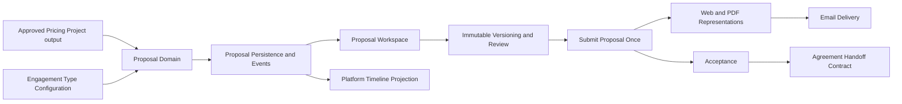

# ADR-018: Proposal Management Implementation Plan

## Date

2026-07-20

## Status

Product Owner Approved — amended 2026-07-21

## Purpose

This ADR converts the approved Proposal Management architecture in ADR-017 into the authoritative incremental development roadmap for Capability 2.

Platform roles, default capabilities, Quality Review, Executive Authorization, Business Justification, audit evidence, and business-record preservation follow ADR-019.

Implementation must preserve:

- Proposal as the system of record rather than a document.
- One Proposal from exactly one Pricing Project in Version 1.
- Immutable Proposal Versions and pricing snapshots.
- Separation between Proposal acceptance and Service Agreement signature.
- Configuration-driven Engagement Types.
- Representation-independent Proposal content.
- Cotarion Consulting Group scope.
- Company and Client isolation.
- Platform Timeline as a read-only projection of immutable business events.

No sprint may introduce Proposal pricing calculations, Agreement legal behavior, Engagement delivery behavior, Proposal Packages, or future operating groups.

## Guiding implementation principles

- Domain invariants precede schema and UI.
- Each sprint delivers an independently testable vertical or foundational slice.
- Source references provide traceability; immutable snapshots provide history.
- Business state and outbox events commit atomically.
- Normal Draft editing does not mutate immutable versions.
- External delivery is idempotent and retry-safe.
- Proposal submission is a single business-state transition; delivery is repeatable communication activity and never resubmits the Proposal.
- Representations consume Proposal Versions and never become the source record.
- Migrations are additive and forward-only.
- Existing Pricing Workspace behavior remains a regression boundary.

## Capability dependency map

## Sprint 0 — Contract and migration readiness

### Objective

Freeze implementation contracts and reconcile existing platform identifiers before adding Proposal behavior.

### Deliverables

- Proposal terminology and stable enum/code catalog.
- Proposal-to-Pricing immutable snapshot contract.
- Initial Engagement Type policy matrix.
- major-record reference-number strategy.
- event envelope and Proposal event catalog.
- representation-neutral structured-content schema.
- migration and rollback/runbook design.

### Dependencies

- ADR-016, ADR-021, and approved Pricing Project persistence.
- ADR-017 approved policies.
- existing Client, Company, User, and authentication boundaries.

### Required decisions encoded

- Exactly one Pricing Project per Proposal.
- Initial Engagement Types: Strategy Session, Advisory, Diagnostic, Project, Retainer.
- 30-day default expiration with retained exception rationale.
- Quality Review and Founder/Admin Executive Authorization under ADR-019.
- Proposal and representation separation.

### Numbering migration policy

Existing `EST-######` Pricing Project numbers are permanent and must not be rewritten. New Pricing Project numbering may transition to `PP-######` only through an additive sequence strategy that:

- preserves every issued `EST-######` number;
- never reuses either prefix;
- prevents concurrent collisions;
- supports both formats as valid historical Pricing Project references.

No migration may cosmetically rename historical records.

### Tests

- contract serialization tests;
- enum/code stability tests;
- snapshot compatibility tests against every Pricing Model;
- numbering transition tests;
- event-envelope validation tests.

### Risks

- Accidental dependence on mutable Pricing Project fields.
- Treating reference-prefix normalization as permission to rewrite history.
- Engagement Type policies remaining underspecified.

### Acceptance criteria

- One approved, typed snapshot contract represents every existing Pricing Model.
- No Proposal contract imports a pricing calculator.
- Initial Engagement Type matrix is complete and versioned.
- Numbering transition preserves existing records.
- Event types and schema versions are stable before persistence begins.

## Sprint 1 — Pure Proposal Domain

### Objective

Implement Proposal business rules without database, framework, rendering, or delivery dependencies.

### Domain implementation order

1. Proposal identifiers and permanent record-number value objects.
2. Proposal status and legal transition matrix.
3. working Draft.
4. immutable Proposal Version.
5. Pricing source snapshot.
6. commercial terms and business dates.
7. recipient and authorized-recipient rules.
8. expiration and retained exception rationale.
9. submission and supersession.
10. acceptance, verbal acceptance, withdrawal, and decline.
11. domain event production.

### Invariants

- Proposal, Client, Company, owner, operating group, Engagement Type, and Pricing Project are compatible.
- A Proposal has exactly one Pricing Project.
- Proposal never recalculates pricing.
- Proposal Version is immutable after creation.
- Submitted offers reference one immutable version.
- replacement submission never inherits acceptance.
- only an eligible submitted version can be accepted.
- verbal acceptance requires responsible user, timestamp, reason, and notes.
- acceptance withdrawal is prohibited after Agreement execution is recorded.
- archived records remain readable.

### Dependencies

- Sprint 0 contracts only.

### Tests

- transition table tests for every legal and illegal status transition;
- immutability tests;
- expiration boundary tests;
- acceptance and withdrawal tests;
- supersession tests;
- business-date tests;
- domain-event tests;
- property tests for version sequencing and state invariants where practical.

### Risks

- Combining working Draft and immutable Version semantics.
- Allowing status setters to bypass domain commands.
- Conflating authorized recipient with an authenticated platform user.

### Acceptance criteria

- Domain compiles without Prisma, Next.js, PDF, email, or storage dependencies.
- All approved policies are enforced through domain commands.
- Illegal transitions return business errors without partial state.
- Domain commands emit complete immutable events.

## Sprint 2 — Database, migrations, repositories, and outbox

### Objective

Persist Proposal identity, drafts, immutable versions, lifecycle evidence, Engagement Types, and events with company isolation and concurrency safety.

### Database implementation order

1. Operating-group reference foundation limited to Consulting Group.
2. versioned Engagement Type configuration.
3. Proposal and concurrency-safe `PRO-######` allocation.
4. Proposal working draft.
5. immutable Proposal Version.
6. one-to-one Proposal Version Pricing source snapshot.
7. recipients and authorization designation.
8. submissions, views, decisions, acceptance withdrawals, and audit evidence.
9. representations and delivery-attempt metadata.
10. transactional event outbox.
11. Platform Timeline projection storage.

### Migration strategy

- Additive forward-only migration files.
- Create nullable relationships first when required for safe backfill.
- Apply constraints after deterministic seed/backfill verification.
- Use database constraints for immutable numbering, one Pricing source per version, Company consistency support, version uniqueness, and required acceptance evidence.
- Prevent ordinary update/delete operations against immutable versions and events through repository boundaries and database protections where practical.
- Seed Engagement Types and configuration non-destructively.
- Fail on baseline drift rather than silently overwriting approved configuration.
- Test migration against an existing database containing Clients, Pricing Projects, configurations, and issued `EST-######` values.

### Repository boundaries

- Proposal repository.
- Proposal Version repository with append-only creation.
- Engagement Type configuration repository.
- Proposal representation metadata repository.
- outbox publisher repository.
- Timeline projection repository, read-only to presentation callers.

Repositories require Company scope explicitly. Timeline repository additionally requires Client scope.

### Dependencies

- Sprint 1 domain.
- PostgreSQL/Prisma platform foundation.

### Tests

- migration deploy from current schema;
- repository CRUD limited to mutable Draft state;
- immutable-version rejection;
- cross-company and cross-client rejection;
- concurrent Proposal and version numbering;
- snapshot precision and JSON round-trip;
- idempotent seed and drift failure;
- atomic business-state/outbox creation;
- Timeline idempotency and deterministic ordering;
- archival without deletion.

### Risks

- Prisma APIs accidentally exposing updates/deletes for immutable records.
- cross-table Company isolation not fully enforced.
- JSON snapshots lacking schema-version validation.
- outbox duplication under retries.

### Acceptance criteria

- Migrations apply to the current development database without modifying historical records.
- Repository integration tests prove Company/Client isolation.
- Concurrent creation cannot duplicate record or version numbers.
- Historical versions and events cannot be mutated through repositories.
- State change and outbox event commit atomically.
- Timeline can rebuild deterministically from published events.

## Sprint 3 and Sprint 4 ownership boundary

Proposal submission is a business event. Proposal delivery and publication are communication and representation events. They have separate, exclusive sprint ownership.

- Sprint 3 exclusively owns submission validation, the submission command, transition to `SUBMITTED`, immutable binding of the submitted Proposal Version, and creation of the one Proposal Submission Event.
- Each Proposal transitions to `SUBMITTED` exactly once and creates one permanent Submission Event. Later delivery, retry, redelivery, or representation work never constitutes another submission.
- Sprint 3 ends when the Proposal and Submission Event have committed atomically in `SUBMITTED` state. It performs no delivery, representation generation, publication, delivery tracking, or read-receipt work.
- Sprint 4 starts from an already-submitted Proposal. It owns representations, publication, delivery attempts, communication tracking, read receipts, retries, and delivery idempotency.
- Delivery may occur multiple times through retries, channels, or authorized redelivery. Each attempt creates communication history and never creates another Submission Event.
- Proposal lifecycle state belongs to the Proposal aggregate and Sprint 3 submission boundary. Representation and delivery state belongs to Sprint 4 metadata and cannot mutate or redefine Proposal submission state.

Sprint 4 portal-publication ownership defines where publication belongs if exercised. It does not authorize the separately deferred Client Portal UI, API, self-service acceptance, or mobile capabilities.

## Sprint 3 — Application services and internal Proposal workspace

### Objective

Deliver the internal workflow for creating, editing, reviewing, versioning, reopening, validating, and submitting Proposals through the single business submission boundary.

### Application implementation order

1. list eligible Pricing Projects.
2. create Proposal from one approved Pricing output.
3. edit working Draft content and commercial terms.
4. manage multiple recipients and authorized-recipient designation.
5. calculate default expiration and record the exception rationale when changed.
6. explicitly Save Version.
7. request/complete Quality Review with reviewer independence.
8. Founder/Admin Executive Authorization with Business Justification and audit evidence.
9. reopen Draft and create revision from an immutable version.
10. validate submission eligibility and bind the selected immutable Proposal Version.
11. execute the submission command, transition to `SUBMITTED`, and persist the single Submission Event atomically.

### UI implementation order

1. Proposal navigation and Client-context entry points.
2. Proposal list with status, Client, Proposal number, Pricing Project, expiration, and update date.
3. single-screen Proposal workspace.
4. Pricing snapshot read-only panel.
5. structured generated-content editor.
6. commercial terms and recipients.
7. calculation-free offer summary.
8. validation errors and warnings.
9. version history.
10. Quality Review, Executive Authorization, and submission validation.
11. explicit Submit action and submitted-version confirmation.
12. Proposal detail and Client-history links.

### UX requirements

- entered Draft values survive validation failures;
- Pricing fields are read-only snapshots;
- Save Draft and Save Version have distinct language;
- immutable versions cannot appear editable;
- warnings are visually distinct from blocking errors;
- business dates and expiration exception rationale are clear;
- responsive desktop and tablet workflow.

### Dependencies

- Sprint 2 persistence.
- existing authentication, protected routes, Client and Pricing interfaces.

### Tests

- application service unit tests;
- authorization-policy tests;
- form validation tests;
- component tests where valuable;
- end-to-end create/edit/save/reopen/version/review workflow;
- submission validation, authorization, concurrency, and atomic event tests;
- end-to-end review-to-`SUBMITTED` workflow with no delivery side effect;
- pricing-model regression matrix;
- accessibility and responsive checks.

### Risks

- UI duplicating lifecycle or pricing rules.
- autosave accidentally creating versions.
- users confusing Proposal title, Proposal number, and version number.

### Acceptance criteria

- User creates a Proposal from one Pricing Project without recalculation.
- Draft can be saved, reopened, and edited.
- Save Version creates an immutable version and normal Draft saves do not.
- Pricing, methodology, and configuration snapshots remain unchanged.
- Founder/Admin can use Executive Authorization with Business Justification; Members cannot.
- Founder/Admin can perform Quality Review, but no Proposal creator can review their own Proposal.
- Submission validation fails without partial state or events.
- The submission command binds one immutable Proposal Version, transitions the Proposal to `SUBMITTED`, and creates exactly one Submission Event atomically.
- Completing Sprint 3 performs no representation generation, portal publication, email delivery, delivery tracking, or read-receipt work.
- Existing Pricing Workspace remains fully operational.

## Sprint 4 — Representations and delivery

### Objective

Consume an existing `SUBMITTED` Proposal to generate reproducible representations, publish or deliver them through approved channels, and track communication without making representation state the source of Proposal business state.

### Implementation order

1. load the immutable submitted Proposal Version without a Proposal-state mutation.
2. representation-neutral Proposal document model.
3. deterministic HTML/Internal Web renderer.
4. deterministic PDF renderer using the same document model.
5. representation checksum and renderer-version metadata.
6. portal-publication adapter and metadata boundary for approved publication channels.
7. email delivery adapter and templated message.
8. delivery-attempt tracking, read receipts, and communication history.
9. idempotent delivery, publication, and retry behavior.

### Integration points

- object-storage abstraction for retained PDFs where evidentiary retention requires it;
- email provider abstraction;
- Auth.js user identity for responsible-user evidence;
- Platform Timeline publication;
- future Client Portal/API renderer contracts.

### Tests

- renderer snapshot/semantic tests;
- PDF content extraction assertions;
- Web/PDF parity tests for material business terms;
- representation regeneration from immutable version;
- email adapter contract tests;
- idempotency and retry tests;
- repeated-delivery and multi-channel tests proving no additional Submission Event is created;
- tests proving representation, delivery, publication, and read-receipt updates cannot mutate Proposal lifecycle state;
- security tests preventing Draft exposure.

### Risks

- layout concerns leaking into Proposal domain.
- PDF and Web displaying different terms.
- duplicate emails after retry.
- exposing internal-only content.

### Acceptance criteria

- Internal Web View and PDF regenerate from the same immutable Proposal Version.
- Representations display identical material pricing and commercial terms.
- Email delivery references the submitted immutable version.
- Portal publication, when an approved channel is enabled, references the same submitted immutable version.
- Delivery may be attempted more than once, but retry, redelivery, publication, and read receipts never create a second Submission Event.
- Delivery and representation metadata never transition or redefine Proposal state.
- Proposal remains usable if a representation provider is temporarily unavailable.

## Sprint 5 — Client decisions, lifecycle completion, and Timeline

### Objective

Complete Proposal acceptance, verbal acceptance, withdrawal, decline, expiration, supersession, archival, and Client History projection.

### Implementation order

1. authorized-recipient acceptance validation.
2. internal verbal-acceptance recording.
3. acceptance evidence and audit event.
4. acceptance withdrawal before Agreement execution.
5. decline.
6. scheduled/idempotent expiration.
7. replacement Proposal supersession and mandatory re-acceptance.
8. archival.
9. Proposal event projection into Client Timeline.
10. Agreement creation handoff contract.

### Dependencies

- submitted immutable versions and the Submission Event from Sprint 3.
- Agreement execution status exposed through a narrow future integration contract.
- Timeline event/outbox foundation from Sprint 2.

### Tests

- recipient authorization tests;
- verbal-acceptance evidence tests;
- withdrawal-before/after-execution tests;
- expiration race tests;
- supersession and non-inheritance tests;
- archive retention tests;
- Timeline ordering/filter/idempotency tests;
- outbox retry and projection rebuild tests;
- end-to-end lifecycle scenarios.

### Risks

- race between acceptance, expiry, and supersession.
- internal user recording verbal acceptance without complete evidence.
- Timeline exposing restricted summaries.
- coupling Proposal completion to an unimplemented Agreement module.

### Acceptance criteria

- Acceptance always references one submitted immutable version.
- Verbal acceptance retains all required evidence.
- Acceptance can be withdrawn only before Agreement execution.
- replacement Proposal requires new acceptance.
- expired, declined, superseded, and archived history remains permanent.
- Client Timeline shows Proposal events deterministically without owning Proposal state.
- Agreement handoff contains approved terms but creates no Engagement directly.

## Sprint 6 — Capability hardening and release readiness

### Objective

Validate Proposal Management as a complete operational capability and prepare it for Product Owner use.

### Deliverables

- complete Client-to-Pricing-to-Proposal workflow;
- migration review package;
- security and isolation review;
- representation parity report;
- lifecycle and retention review;
- Product Owner operating guide;
- milestone report and refinement-backlog entries;
- release documentation.

### Validation suite

- Prisma format, validate, generate, and migration deploy.
- lint and TypeScript.
- unit and integration suites.
- repository and database-constraint suites.
- browser end-to-end suite.
- production build with development authentication disabled.
- `git diff --check`.
- ignored-secret and generated-artifact checks.
- existing Client, authentication, Project Pricing, Retainer, Hybrid, Profit-Share, and Advisory regressions.

### Operational scenarios

- create each Engagement Type from compatible Pricing.
- Draft save/reopen/edit.
- validation failure retains form values.
- Save Version and prove immutability.
- Quality Review and Executive Authorization.
- submit once without delivery.
- generate and deliver Web/PDF/email representations from the submitted version.
- retry delivery and regenerate representation without creating another Submission Event.
- accept by authorized recipient.
- record verbal acceptance.
- withdraw before Agreement execution.
- decline, expire, supersede, and archive.
- verify permanent Client Timeline history.

### Risks

- incomplete production legal content.
- email/PDF provider environmental differences.
- hidden cross-company access paths.
- historical snapshots not sufficient for exact regeneration.

### Acceptance criteria

- Every approved Proposal workflow completes without developer tools.
- No representation or Timeline component owns Proposal business state.
- Every historical version and event remains reproducible and immutable.
- Company isolation and recipient authorization pass adversarial tests.
- no Critical Defects remain.
- legal templates are explicitly marked non-production until legal review.
- Product Owner can begin operational acceptance.

## Cross-sprint testing strategy

### Test pyramid

- Pure domain tests for lifecycle and invariant density.
- Application tests for orchestration and authorization.
- Repository integration tests against PostgreSQL.
- contract tests for Pricing, rendering, email, Agreement handoff, and events.
- focused UI tests for complex Draft behavior.
- end-to-end tests for critical operating workflows.

### Mandatory regression boundaries

- Microsoft authentication and development-auth isolation.
- Company isolation.
- Clients and contacts.
- every Pricing Model.
- Pricing Configuration and methodology preservation.
- estimate/reference-number permanence.
- protected routes and production build.

### Test data

- deterministic factories with unique prefixes;
- cleanup in `finally`;
- no mutation of approved baseline seed data;
- no retained test Clients, Pricing Projects, Proposals, events, files, or emails;
- explicit positive, negative, concurrency, and historical-version cases.

## Integration contracts

### Pricing

Read the current approved immutable Pricing Version from a `QUOTED` Pricing Project under ADR-021 and freeze its identity and commercial snapshot. Never call calculation functions or Pricing approval mutations from Proposal Management.

### Client and Contacts

Reference platform identities and snapshot only presentation data required to reproduce the offer and recipients.

### Authentication and authorization

Use the authenticated Application User and Company scope. Implement ADR-019 role defaults behind a capability-oriented authorization policy interface. Quality Review enforces reviewer independence. Executive Authorization is limited to Founder/Admin, requires Business Justification, and records the authorized individual, submission method, review method, and permanent audit evidence.

The frozen Sprint 0 machine code `INTERNAL_REVIEW` remains a compatibility code for the business-facing Quality Review state until an explicitly governed contract migration occurs. New application and user-interface language uses “Quality Review.”

### Platform Timeline

Publish immutable Proposal events through the outbox. Timeline consumes the event envelope and never imports Proposal repositories.

### Representations

Render from immutable Proposal Version structured content through replaceable renderer ports.

### Email

Deliver a representation/reference using an idempotent provider adapter. Delivery status does not redefine Proposal state.

### Agreement

Publish/request Agreement creation from accepted terms through a narrow contract. Proposal Management does not assemble legal clauses.

## Migration governance

- Never rewrite applied migrations.
- Never renumber existing records.
- Never delete major business records as cleanup.
- Use archival lifecycle states.
- Document backfills and validate row counts before constraints.
- Maintain downgrade guidance even when production rollback uses forward fixes.
- Run schema-drift and migration-history validation before release.
- Require database backups/restore verification before a production migration.

## Commit boundaries

Recommended commits:

1. Proposal contracts and pure domain.
2. Proposal domain tests.
3. Prisma schema and forward migration.
4. repositories, seeds, outbox, and integration tests.
5. application services.
6. internal Proposal workspace.
7. immutable versioning UI.
8. Web/PDF renderers.
9. representation publication and email delivery.
10. acceptance and lifecycle completion.
11. Timeline projection.
12. documentation and release validation.

Each commit should build and test independently. Schema and generated client changes belong in the same commit as their migration.

## Pull request boundaries

If pull requests are used:

1. Domain and contracts.
2. Persistence, migrations, events, and Timeline foundation.
3. Internal authoring and versioning.
4. representations, publication, and delivery.
5. acceptance, lifecycle, Timeline, and hardening.

Avoid a single Proposal Management pull request unless repository governance explicitly requires it.

## Technical debt intentionally deferred

- capability expansion beyond the ADR-019 default role capabilities;
- Client Portal/API/mobile representations;
- online self-service acceptance;
- Proposal Packages and Proposal Sections;
- other operating groups;
- revision visual comparison;
- notifications and reminders;
- Proposal analytics;
- electronic signatures;
- Agreement Engine implementation;
- Engagement termination implementation;
- AI drafting;
- full-text Timeline search;
- Timeline rebuild administration UI.

Deferred items must retain extension contracts but receive no Version 1 implementation.

## Capability exit criteria

Proposal Management is complete when:

- one Pricing Project can produce one Proposal;
- Draft, immutable version, review, submission, representation, delivery, decision, revision, expiration, supersession, and archival workflows operate;
- Proposal never recalculates pricing;
- acceptance is distinct from Agreement signature;
- Agreement handoff references accepted immutable terms;
- Client History shows immutable Proposal events;
- all validation and regression gates pass;
- Product Owner can perform the complete workflow in a browser;
- no production claim is made for unreviewed legal templates.

## Related decisions

- ADR-000: Cotarion Product Development Methodology
- ADR-005: Engagement Lifecycle Architecture
- ADR-012: Permanent Document Retention
- ADR-014: In-Application PDF Rendering With Future Worker Option
- ADR-015: Application Users Belong to One Company Workspace
- ADR-016: Shared Pricing Project With Explicit Pricing Models
- ADR-017: Proposal Management Business Architecture
- ADR-019: Platform Governance & Decision Authority
- ADR-020: Platform Role Administration & Founder Bootstrap
- ADR-021: Pricing Approval & QUOTED Lifecycle
