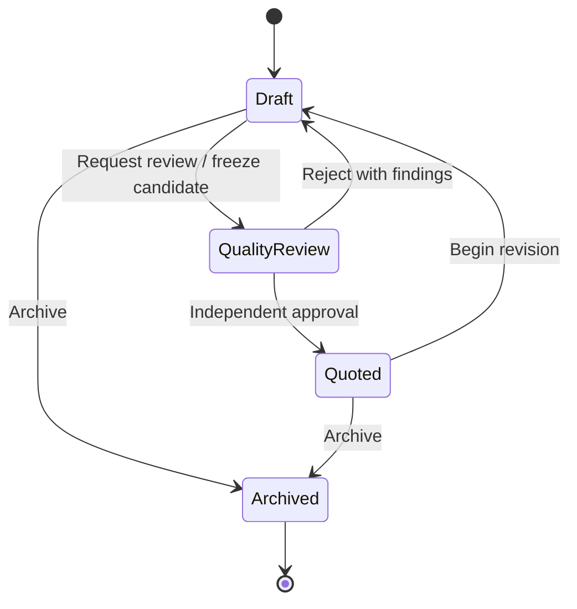

# ADR-021: Pricing Approval & QUOTED Lifecycle

## Date

2026-07-21

## Status

Proposed

## Context

ADR-016 establishes `PricingProject` as the shared Pricing aggregate. ADR-017 and the frozen Proposal contracts require Proposal Management to consume one eligible Pricing source in `QUOTED` status without recalculation. The architecture does not yet govern the path from mutable Pricing work to that eligible source.

Without this decision, implementation would have to invent reviewer authority, reviewer independence, approval and rejection behavior, approved-version immutability, and Proposal eligibility. This ADR resolves Sprint 3 readiness blocker CB-2 while preserving Pricing as the authoritative bounded context for commercial calculations.

## Decision

Version 1 retains the existing lifecycle codes `DRAFT`, `IN_REVIEW`, `QUOTED`, and `ARCHIVED`. `IN_REVIEW` is the stable machine code for the business-facing Pricing Quality Review state.

Requesting Quality Review creates an immutable candidate Pricing Version. An eligible, independent Founder or Admin reviews that exact version. Approval selects it as the current approved version and moves the Pricing Project to `QUOTED`. Rejection retains it and returns the project to `DRAFT`.

Only the current approved Pricing Version of a currently `QUOTED` Pricing Project is eligible for new Proposal creation. Proposal freezes that version's identity and commercial snapshot permanently.

## Scope and non-goals

This ADR governs the Pricing lifecycle, Quality Review, `QUOTED` eligibility, immutable Pricing Versions, review authority and independence, Pricing-to-Proposal consumption, and permanent approval evidence.

It does not redesign Pricing calculations, Proposal architecture or lifecycle, authentication, authorization, Company architecture, persistence, APIs, application services, or UI. It authorizes no implementation.

## Terminology

**Pricing Project** is the workflow aggregate and permanent business identity established by ADR-016.

**Pricing Version** is an immutable record of Pricing inputs, configuration, methodology, calculations, outputs, currency, ownership context, and responsible creator at a review boundary.

**Candidate Pricing Version** is the immutable version created when Quality Review is requested.

**Approved Pricing Version** is a candidate that passed Quality Review. Approval never changes its captured content.

**Current approved Pricing Version** is the most recently approved version selected by a `QUOTED` Pricing Project. It alone is eligible for new Proposal creation.

**Pricing Version creator** is the identified user who requests review and attests that the candidate represents completed Pricing work. Reviewer independence is evaluated against this user.

## Pricing lifecycle

### `DRAFT`

`DRAFT` is the only mutable state. Authorized users may change Pricing inputs and recalculate outputs inside the Pricing bounded context. A Draft is neither approved nor Proposal-eligible. Draft edits never mutate an earlier Pricing Version.

Beginning a revision of a `QUOTED` project returns it to `DRAFT` and pauses eligibility for new Proposals while retaining all prior versions and approvals.

### `IN_REVIEW` — Quality Review

`IN_REVIEW` means one immutable candidate version is awaiting an independent decision.

- Requesting review atomically creates and binds the candidate, records request evidence, and changes status.
- Working content is frozen while review is pending.
- Only the bound candidate may be approved or rejected.
- Editing, concurrent review requests, archival, and new Proposal consumption are prohibited.

### `QUOTED`

`QUOTED` means:

- the current commercial output passed independent Quality Review;
- exactly one immutable Pricing Version is identified as current and approved;
- permanent approval evidence exists; and
- that version is eligible for new Proposal creation, subject to Proposal compatibility rules.

It does not mean a Proposal exists or has been submitted, delivered, or accepted. It does not authorize Pricing modification.

### `ARCHIVED`

`ARCHIVED` is the retained inactive state. The project, versions, reviews, Proposal references, and audit evidence remain permanently readable. It is ineligible for new Proposals and terminal in Version 1. Restoration requires a future approved decision.

Archival never invalidates an existing Proposal snapshot or rewrites the historical fact that a version was approved.

## Legal transitions

| From | Action | To | Required result |
| --- | --- | --- | --- |
| New | Create | `DRAFT` | Mutable Company-scoped work begins. |
| `DRAFT` | Request Quality Review | `IN_REVIEW` | Candidate version and request evidence are created atomically. |
| `IN_REVIEW` | Approve | `QUOTED` | Candidate becomes current approved version; evidence commits atomically. |
| `IN_REVIEW` | Reject | `DRAFT` | Candidate and findings remain; revision may begin. |
| `QUOTED` | Begin revision | `DRAFT` | Approved history remains; eligibility pauses. |
| `DRAFT` | Archive | `ARCHIVED` | Draft is retained and removed from active work. |
| `QUOTED` | Archive | `ARCHIVED` | Approved history remains; new eligibility ends. |

Every other transition is prohibited. Direct `DRAFT` to `QUOTED`, `IN_REVIEW` to `ARCHIVED`, and transitions out of `ARCHIVED` are illegal.

## Pricing Quality Review

### Purpose

Quality Review verifies that the frozen commercial output is complete, internally consistent, appropriate for the Client and intended work, and ready for Proposal consumption. It is quality assurance under ADR-019, not a second calculation engine. The reviewer cannot edit or replace the candidate.

### Request eligibility

- An active Member, Admin, or Founder with Pricing work capability may request review for an authorized same-Company Draft.
- The requester is the Pricing Version creator.
- Pricing-domain validation and calculation must have completed successfully.
- Company, Client, owner, Pricing Model, configuration, methodology, inputs, outputs, currency, and calculation evidence must be complete and compatible.

### Reviewer eligibility and independence

- The reviewer must be an active same-Company Founder or Admin with Pricing Quality Review capability.
- The reviewer cannot be the candidate's creator.
- Authorization and independence are revalidated when the decision commits.
- Ownership transfer, role change, or UI visibility cannot defeat creator independence.
- A Founder or Admin who created the candidate must obtain another eligible reviewer.

Executive Authorization cannot replace or self-perform Pricing Quality Review in Version 1. No Pricing Project becomes `QUOTED` without an independent reviewer. Any future alternate path requires an explicit amendment.

### Approval

Approval atomically records the reviewer and decision, marks the candidate approved without changing its content, selects it as current, and changes `IN_REVIEW` to `QUOTED`. Failure of validation, authorization, binding, or audit persistence leaves all state unchanged.

### Rejection

Rejection requires actionable findings. It atomically records the negative decision, retains the candidate unchanged, and returns the project to `DRAFT`. Later edits affect only the working Draft; a new request creates the next immutable version.

Review findings are domain evidence, not Business Justification. ADR-019 reserves Business Justification for an alternate governance path, and this ADR authorizes no such Pricing path in Version 1.

## Pricing Version architecture

Each Pricing Project owns a monotonically increasing sequence of immutable versions. Each version permanently records at minimum:

- Pricing Project, estimate number, Company, Client, and owner identities;
- version number, creator, and creation timestamp;
- Pricing Model and currency;
- Pricing Configuration identity/version;
- methodology and engine version;
- normalized calculation inputs;
- calculation outputs, adjustments, and rounding result;
- schema/serialization version; and
- review status with append-only review evidence.

Captured business content is immutable from creation. Approval attaches evidence and selection; it never rewrites inputs or outputs. Version numbers are unique and monotonically increasing per Pricing Project. Rejected and superseded numbers remain permanent and are never reused.

### Revision and stale-version handling

- A `QUOTED` revision creates editable Draft state without modifying the approved version.
- While the project is `DRAFT` or `IN_REVIEW`, no version is eligible for a new Proposal, even if an older approval exists.
- Approval of a later version makes it current. Earlier approved versions remain historically approved but are superseded for new Proposal creation.
- Existing Proposals retain the exact version originally consumed despite later revision, rejection, approval, or archival.
- A new Proposal may consume only the current approved version while the project is `QUOTED`.
- No Proposal refreshes automatically. Use of later Pricing requires a separately governed Proposal creation or revision action.

“Stale” means not current for new Proposal creation; it never means mutable, deleted, invalid, or historically incorrect.

## Proposal relationship

Proposal Management may consume exactly one approved immutable Pricing Version from exactly one eligible Pricing Project.

At consumption, the project must be `QUOTED`, the version must be its current approved version, and Pricing/Proposal must satisfy ADR-017 Company, Client, currency, operating-group, ownership, and compatibility rules. Proposal retains Pricing Project, Pricing Version, approval, configuration, methodology, and commercial snapshot identities needed for reproduction.

Proposal never creates, edits, approves, rejects, archives, or changes Pricing; never recalculates Pricing; and never substitutes a later version automatically. Pricing owns calculation and approval. Proposal owns its downstream offer and frozen representation.

## Capability relationship

Capabilities follow ADR-019 and Company-scoped administration under ADR-020. Roles supply Version 1 defaults; application boundaries evaluate effective capabilities.

| Action | Member | Admin | Founder |
| --- | --- | --- | --- |
| Create/edit authorized Draft | Allowed | Allowed | Allowed |
| Request Quality Review | Allowed | Allowed | Allowed |
| Review, approve, or reject another creator's candidate | Not allowed | Allowed | Allowed |
| Review, approve, or reject own candidate | Not allowed | Not allowed | Not allowed |
| Begin authorized `QUOTED` revision | Allowed | Allowed | Allowed |
| Archive own/authorized `DRAFT` project | Allowed | Allowed | Allowed |
| Archive authorized `QUOTED` project | Not allowed | Allowed | Allowed |

Every action also requires active authentication, same-Company scope, record access, and any narrower Pricing ownership rule. Higher authority never removes reviewer independence.

## Audit requirements

Review requests, decisions, revision starts, and archival are permanent, structured, append-only, Company-scoped, searchable significant-action evidence under ADR-019.

Every Quality Review decision records:

- Pricing Project and estimate number;
- immutable candidate version identity/number;
- Company and Client;
- creator and reviewer;
- request and decision timestamps;
- outcome: approved or rejected;
- Review Method: Quality Review;
- findings when rejected;
- resulting Pricing status;
- approved version identity when approved; and
- Business Justification when an approved governance path requires it.

Version 1 has no Executive Authorization path for Pricing approval, so Business Justification cannot substitute for review. Candidate version, decision, lifecycle transition, and current-version binding commit atomically. Corrections add evidence and never rewrite history.

## Company isolation and dependency direction

- Project, versions, creator, reviewer, Client, and evidence share one Company boundary.
- Pricing application services own review commands and enforce authorization, independence, lifecycle, and atomicity.
- Pricing repositories persist aggregate state and versions behind Company-scoped interfaces.
- Proposal queries eligibility through an explicit read contract and cannot call Pricing mutation or approval commands.
- Pricing does not import Proposal domain or repositories.
- Proposal may depend on the Pricing eligibility/snapshot contract, preserving Pricing-to-Proposal dependency direction.

## Invariants

1. Only `DRAFT` is mutable.
2. Each review request binds exactly one immutable candidate version.
3. Each candidate receives exactly one terminal review outcome.
4. A candidate creator cannot decide that candidate.
5. Only an active same-Company Founder/Admin with review capability may decide.
6. `QUOTED` identifies exactly one current approved immutable version.
7. No direct `DRAFT` to `QUOTED` transition exists.
8. Executive Authorization cannot bypass Pricing Quality Review in Version 1.
9. New Proposals consume only the current approved version of a `QUOTED` project.
10. Proposal consumes exactly one version and never recalculates or mutates it.
11. Later Pricing activity never changes existing Proposal snapshots.
12. Versions and evidence are never deleted, renumbered, or rewritten.
13. State, version binding, and evidence change atomically.
14. Every operation enforces Company isolation.

## Consequences

### Benefits

- Pricing approval and Proposal eligibility have one testable definition.
- Commercial output receives independent review without moving calculations into Proposal.
- Every Proposal identifies the exact approved source version.
- Rejection and revision preserve complete history.

### Costs and risks

- A Company needs two distinct eligible people to approve Pricing created by a Founder/Admin.
- Future implementation requires version persistence and transactional evidence.
- Current mutable Pricing storage does not itself satisfy this architecture.
- Proposal creation must fail closed when the project/version is not current and eligible.

## Rejected alternatives

- **Let Proposal approve Pricing:** rejected because it reverses bounded-context ownership.
- **Treat mutable fields as the approved snapshot:** rejected because later edits could change reviewed commercial output.
- **Allow creator self-review:** rejected because it defeats reviewer independence.
- **Use Executive Authorization for self-approval:** rejected because commercial approval requires independent review.
- **Keep an older approval eligible during revision:** rejected because new Proposals could consume terms actively being replaced.
- **Update Proposals after later Pricing approval:** rejected because it destroys historical reproducibility.
- **Delete rejected or superseded versions:** rejected because review history is permanent business evidence.

## Acceptance criteria

- All Version 1 states, transitions, request, approval, rejection, revision, and archival outcomes are defined.
- `QUOTED` has one precise eligibility meaning.
- Reviewer authority and independence need no implementation assumption.
- Immutable candidate/approved versions and stale-version behavior are explicit.
- Proposal consumption preserves Pricing ownership and exact-version history.
- Required evidence, atomicity, capabilities, and Company isolation are explicit.
- Implementation needs no new business-policy assumption to resolve CB-2.

## Related decisions

- ADR-000: Cotarion Product Development Methodology
- ADR-016: Shared Pricing Project With Explicit Pricing Models
- ADR-017: Proposal Management Business Architecture
- ADR-018: Proposal Management Implementation Plan
- ADR-019: Platform Governance & Decision Authority
- ADR-020: Platform Role Administration & Founder Bootstrap

